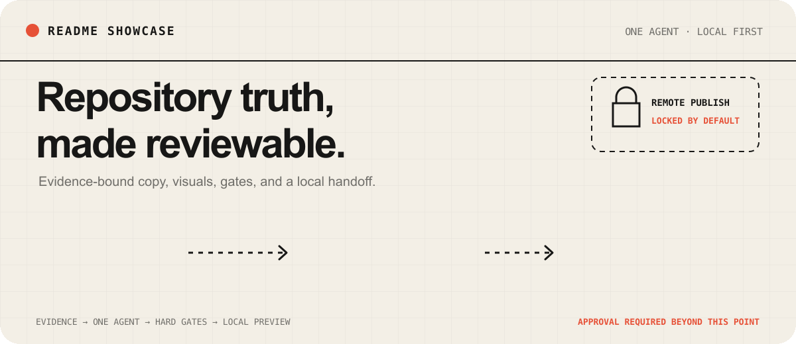
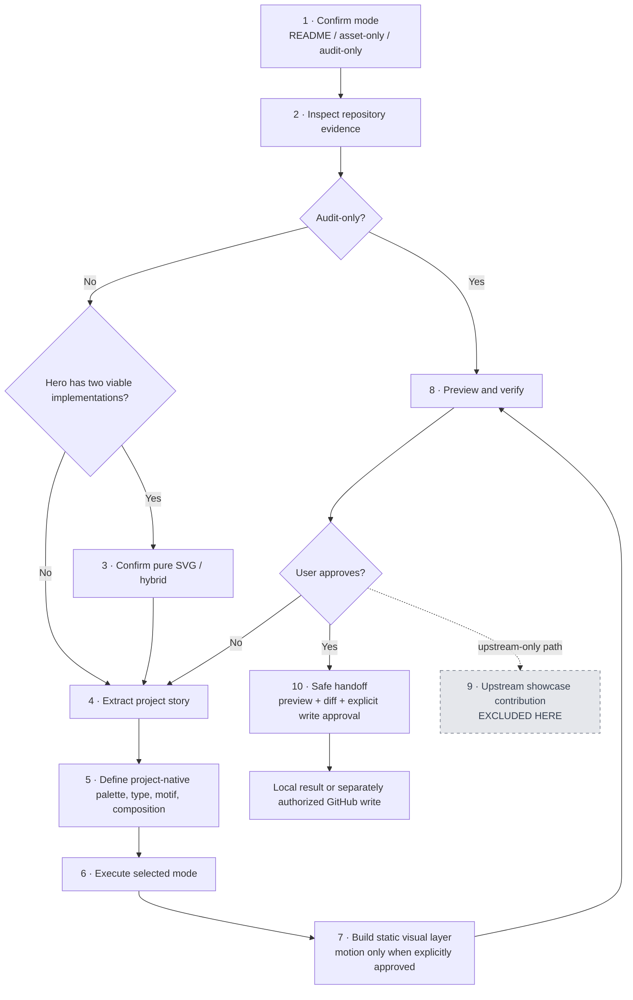
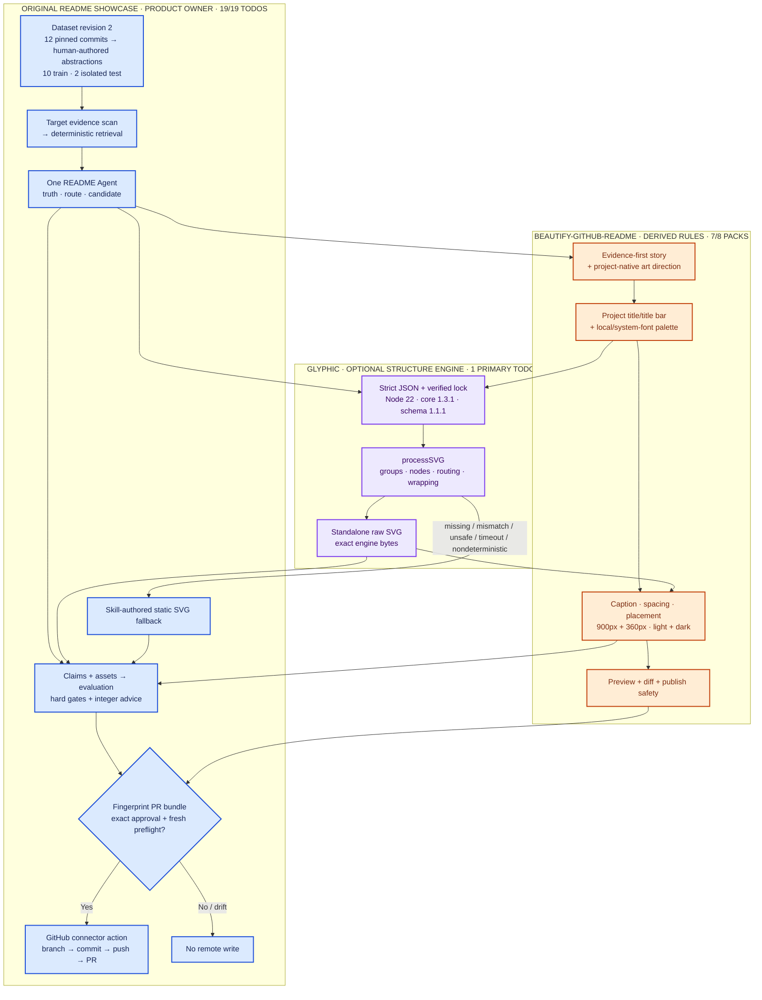
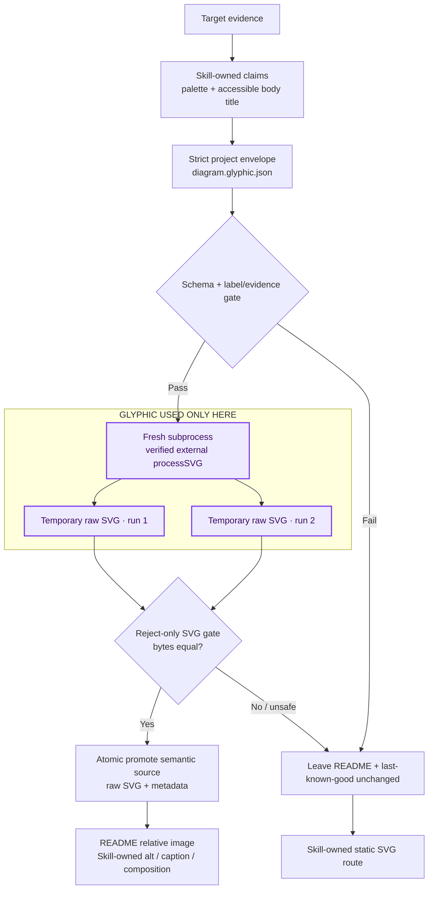
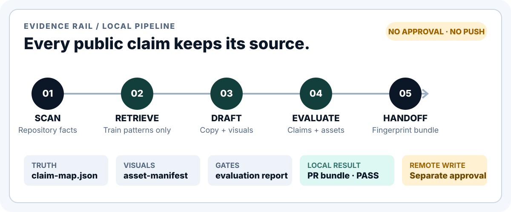

<p align="center">
  
</p>

<p align="center">
  <strong>English</strong> · <a href="./README_zh.md">简体中文</a>
</p>

<p align="center">
  <a href="./LICENSE"></a>
  
  
</p>

`readme-showcase` is a one-Agent, evidence-to-PR pipeline for redesigning GitHub
README homepages from verified repository behavior. Markdown carries
searchable facts; visuals earn their place by proving identity, output,
sequence, or architecture. Evaluation produces a local fingerprinted PR bundle,
never an automatic remote write.

## One pipeline, three owners

### 1. `beautify-github-readme` source workflow

This is the editorial and visual workflow adapted from
[`oil-oil/beautify-github-readme`](https://github.com/oil-oil/beautify-github-readme).
Its showcase-contribution stage is deliberately excluded.



### 2. Dataset-to-PR pipeline with explicit ownership



Dataset content is intentionally small and abstract. Production retrieval can
see ten `train` records from GitHub CLI, Deno, FastAPI, Flask, HTTPX, Pydantic,
Requests, Ruff, Tokio, and Vite. Next.js and pytest are isolated `test` records
and cannot enter production retrieval. Every record stores facets, newly
authored `summary` / `structure` / `proof`, a pinned repository commit and
material hash, reviewed SPDX/license evidence, and split. It stores no copied
README text, code, badges, logos, images, animation, or benchmark answers.
See [dataset source ledger](dataset/README.md).

### 3. Glyphic source boundary and failure transition



### Responsibility boundary

| Layer | Owns | Must not own |
| --- | --- | --- |
| Original `readme-showcase` | Dataset, target evidence, retrieval, one Agent, schemas, claims, evaluation, fallback, PR bundle, approval, install | Upstream/engine source, unrelated target files, unapproved remote state |
| Adapted `beautify-github-readme` rules | Story order, title/title bar, palette selection, project-native art direction, composition, visual/motion policy, preview safety | Target facts, approval fingerprint, engine internals |
| Optional Glyphic | `architecture` / `flowchart` / `c4` body groups, nodes, layout, routing, wrapping, raw SVG bytes | Hero, title/title bar, palette choice, copy, claims, alt/caption, composition, fallback, evaluation, publish |

### Exact reuse

| Measurement | Used |
| --- | ---: |
| Original product ownership | `19/19 Todos = 100%` |
| BGR reference packs mapped | `7/8 = 87.5%` |
| BGR direct Todo touchpoints | `7/19 = 36.84%` |
| Additional BGR safe-handoff Todos | `2/19 = 10.53%` |
| BGR exact unchanged script lines | `649/692 = 93.79%` |
| Current adapted audit + motion scripts | `992 lines` |
| BGR showcase assets copied | `0/29 = 0%` |
| Glyphic primary implementation | `1/19 = 5.26%` |
| Glyphic-touching Todos | `7/19 = 36.84%` |
| Glyphic packages/source tracked | `0` |

Counts overlap: rules can influence a product-owned Todo without taking product
ownership.

### Excluded here, and why

“Excluded” means not adopted by this project; it does not declare upstream
features deprecated.

| Source | Excluded part | Reason |
| --- | --- | --- |
| BGR | `showcase-contribution` pack / stage 9 | This product hands off locally and requires fingerprint-bound approval; it does not submit to an upstream gallery or auto-open PRs. |
| BGR | Upstream heroes, badges, examples, and case-study assets | Target identity and evidence must remain project-native; copied assets would weaken truth and licensing boundaries. |
| BGR | Automatic ImageGen or GIF selection | Raster generation and motion are opt-in because they add nondeterminism, dependencies, and review cost. |
| BGR | BGR as runtime/product core | Only editorial and visual rules are reused; original pipeline keeps truth, evaluation, fallback, and publishing authority. |
| Glyphic | Full application, MCP/API/hosted service, required package, vendored source, tracked `node_modules` | Optional external execution keeps FSL software and Node/native dependencies outside default Skill/runtime. |
| Glyphic | Canvas/freeform, Gantt, date-sensitive charts, PNG, ReactFlow, raster output | Approved scope is three relationship-heavy, static GitHub-safe SVG body diagrams. |
| Glyphic | Coordinates, icons, custom fonts/URLs/images, arbitrary metadata | Strict semantic projection prevents hidden claims, remote resources, unsafe SVG, and brittle composition. |
| Glyphic | Hero/title/palette/copy/claims/composition/evaluation/publish ownership | Those decisions belong to target evidence, original Agent, and adapted BGR rules. |
| Glyphic | SVG post-editing, wrapping, inlining, or base64 embedding | Raw engine bytes stay hash-bound and independently auditable; any failure selects static fallback. |

## Evidence before decoration



The skill follows one reading order:

> **Value → Proof → Mechanism → First use → Detail**

| Desk | Question it must answer |
| --- | --- |
| Inspect | Who is this for, what works, and where are the limits? |
| Select | Which project type, sections, and editing mode fit the evidence? |
| Draft | What is the shortest truthful route from value to first success? |
| Visualize | Does an SVG, screenshot, or opt-in GIF improve understanding? |
| Verify | Do claims, commands, links, assets, and language variants hold up? |

Unsupported claims are removed. Decorative visuals stay out. Publishing always
requires separate approval.

## Install and run

```bash
git clone https://github.com/Acfufu/readme-showcase.git
cd readme-showcase

python3 scripts/install_skill.py
python3 scripts/install_skill.py --check
```

Expected statuses:

```text
"status":"installed"
"status":"current"
```

Upgrade uses a verified sibling staging directory, atomically swaps the Skill,
and keeps the prior tree at
`.../skills/readme-showcase.backup.<UTC>.<hash>`. A failed copy, hash check, or
swap restores the old target. The installed tree contains no Glyphic package,
engine lock, `node_modules`, or credentials.

Start a new Codex task so skill discovery reloads, then invoke:

```text
$readme-showcase Redesign this repository README around verified behavior and a runnable quick start.
```

First observable behavior: skill inspects repository evidence, then selects
README mode or asks whether scope is whole-README versus asset-only when unclear.

## Three modes, one boundary

| Mode | Changes | Use it for |
| --- | --- | --- |
| README | Copy, reading order, proof, Markdown, justified visuals | A complete repository homepage |
| Asset-only | Requested visual files only | A hero, workflow, badge, diagram, or coordinated set |
| Audit-only | Findings only; no candidate README or assets | Evidence, safety, parity, and publish-readiness review |

README mode may change README structure and justified assets. Asset-only mode
leaves README byte-for-byte unchanged unless embedding receives separate
approval. Audit-only mode stops before generation, PR bundling, and publish
gates. GIF generation requires explicit opt-in.

Example asset-only request:

```text
$readme-showcase Create a static workflow SVG from this repository's real architecture. Do not edit the README.
```

## What ships

```text
dataset/retrieval/manifest.json       # 12 licensed abstract pattern records
skill/
├── SKILL.md                          # one-Agent workflow and scope gates
├── agents/openai.yaml                # Codex discovery metadata
├── references/                       # structure, BGR delta, Glyphic, visuals
└── scripts/
    ├── readme_pipeline.py            # eight deterministic pipeline commands
    ├── render_glyphic.mjs            # optional verified structure adapter
    ├── audit_readme.py               # README and SVG hard gates
    └── render_motion_gif.py          # opt-in motion renderer
scripts/build_glyphic_engine_lock.py  # isolated external-engine lock builder
.github/workflows/ci.yml              # Node-free matrix + isolated integrations
```

## Verify a result

Audit any generated README:

```bash
python3 skill/scripts/audit_readme.py /path/to/project/README.md
```

Validate dataset, scripts, and both language variants:

```bash
python3 skill/scripts/readme_pipeline.py validate-dataset \
  --manifest dataset/retrieval/manifest.json
python3 -m py_compile skill/scripts/*.py scripts/*.py
python3 skill/scripts/audit_readme.py README.md
python3 skill/scripts/audit_readme.py README_zh.md
python3 -m unittest discover -s tests -v
```

`audit_readme.py` uses Python standard library only. Motion rendering additionally
needs Pillow, `ffmpeg`, and either `rsvg-convert` or macOS `sips`.

## Boundaries

- Repository evidence controls claims and sections.
- Commands and changing facts remain copyable Markdown.
- Static SVG is default for deterministic visuals; GIF is opt-in.
- Glyphic is optional, external, exact-version locked, and never needed for the default path.
- Generated assets use target repository's `assets/readme/` convention.
- Evaluation Pass authorizes only a local PR bundle.
- Commits, pushes, publishing, and remote changes need explicit approval.

## License

Project distributed under [GNU General Public License v3.0](LICENSE).

Bundled rendering and audit scripts include work adapted from
[`oil-oil/beautify-github-readme`](https://github.com/oil-oil/beautify-github-readme).
Upstream MIT attribution and license text remain in
[`skill/references/motion-production.md`](skill/references/motion-production.md#upstream-license).

Optional Glyphic is not distributed with this repository. A user-supplied
verified `@glyphicjs/core@1.3.1` installation remains under
`FSL-1.1-ALv2`; see
[`skill/references/glyphic-structure.md`](skill/references/glyphic-structure.md).
