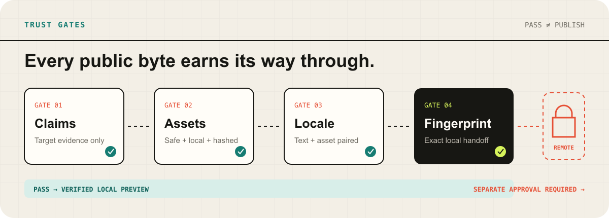
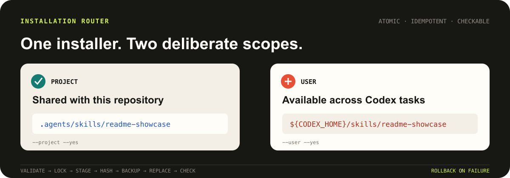
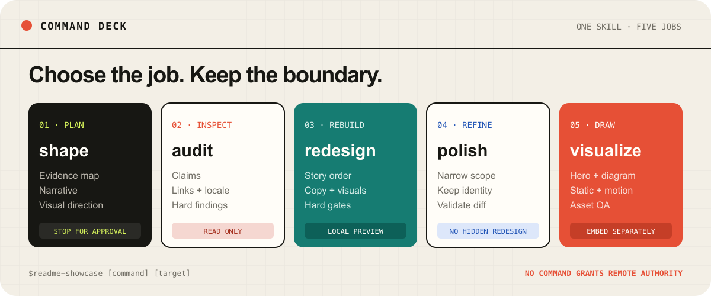
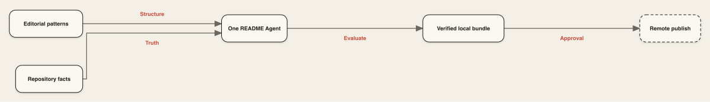
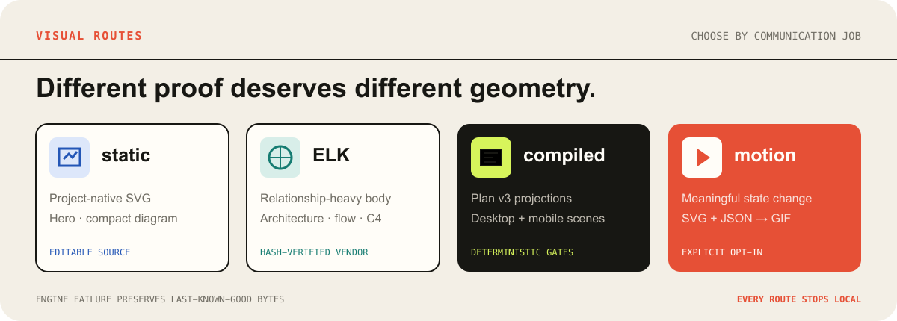

<p align="center">
  
</p>
<p align="center"><sub><a href="./assets/readme/hero.svg">Static fallback</a> · Evidence in · Reviewable local preview out · Remote locked</sub></p>

<p align="center"><strong>English</strong> · <a href="./README_zh.md">简体中文</a></p>

`readme-showcase` is a Codex Skill that redesigns a GitHub repository homepage
from repository evidence—not invented product truth. One README Agent scans the
target, retrieves licensed editorial patterns, authors project-native copy and
visuals, checks every public byte, then stops at a fingerprinted local preview.

> [!IMPORTANT]
> A passing evaluation authorizes local review only. Commit, push, publication,
> and pull-request creation always require separate explicit approval.


<p align="center"><sub>Four hard gates lead to a local handoff; remote publication stays separately locked.</sub></p>

## What it changes

| Repository supplies | README Showcase produces | You keep control of |
| --- | --- | --- |
| Tracked files, commands, configuration, tests | Evidence map and claim-bound narrative | Which scope is approved |
| Existing identity, UI, diagrams, real output | Project-native static or opt-in motion assets | What enters the README |
| Current base SHA and dirty-tree state | Validated bilingual candidates and local preview | Every Git and remote action |

The README remains useful when images fail: commands, prerequisites,
limitations, links, and changing facts stay searchable Markdown.

## Install once, verify the bytes


<p align="center"><sub>One atomic installer, two explicit scopes, exact-byte verification.</sub></p>

Requirements: macOS or Linux, Python 3.11+, and Codex. Default operation adds
no third-party Python runtime dependency.

### Option 1 · CLI

```bash
# English install check
npx --yes github:Acfufu/readme-showcase skills install
npx --yes github:Acfufu/readme-showcase skills check
```

Interactive installation detects an existing scope. Automation can choose one
explicitly:

```bash
# English explicit scopes
npx --yes github:Acfufu/readme-showcase skills install --project --yes
npx --yes github:Acfufu/readme-showcase skills install --user --yes
```

Project scope writes `.agents/skills/readme-showcase`; user scope writes
`${CODEX_HOME:-$HOME/.codex}/skills/readme-showcase`. Observable success is
`"status":"installed"` followed by `"status":"current"`. Use the same scope
with `skills update` to refresh an existing installation. Legacy no-argument
install and `--check` invocations remain supported.

### Option 2 · Hand it to an Agent

Send this exact request to your coding Agent:

```text
Please install this Skill: https://github.com/Acfufu/readme-showcase
```

The Agent should confirm scope, run the official installer and `skills check`,
then report the installed path and status.

## One Skill source, three Agent platforms

This repository authors one portable Agent Skills package under `skill/`; it
does not maintain separate Codex, Claude Code, or OpenCode copies. Format
compatibility does not mean the current Codex-oriented installer supports every
platform path:

| Platform | Current discovery and installer support | Invocation |
| --- | --- | --- |
| Codex | Officially installed and verified in project or user scope | `$readme-showcase shape .` |
| Claude Code | Recognizes `readme-showcase` under `.claude/skills`; audit-only runtime acceptance passed with Claude Code 2.1.222; the current installer does not write that target | `/readme-showcase shape .` |
| OpenCode | Recognizes the current project install under `.agents/skills`; audit-only runtime acceptance passed with OpenCode 1.18.13; the current user install under `~/.codex/skills` is not an OpenCode discovery path | Ask it to use the `readme-showcase` Skill so its native `skill` tool loads it |

Runtime acceptance on 2026-08-06 verified that both CLIs loaded the Skill,
executed its audit-only route, reported a seeded broken local link, and left the
fixture unchanged. Both runs used the `deepseek-v4-flash` model ID; OpenCode
records it as `opencode-go/deepseek-v4-flash`, whose catalog name is
`DeepSeek V4 Flash (New)`. This acceptance does not extend to README authoring,
visual generation, or publication routes.

## Five commands, three execution modes


<p align="center"><sub>Five user intents over three established execution modes.</sub></p>

Start a new Codex task so Skill discovery reloads:

| Command | Job | Default stop |
| --- | --- | --- |
| `$readme-showcase shape [target]` | Map evidence, narrative, scope, and visual direction | Approval; no candidate files |
| `$readme-showcase audit [target]` | Inspect claims, structure, links, locale, and assets | Findings only |
| `$readme-showcase redesign [target]` | Rebuild an approved README scope | Validated local preview |
| `$readme-showcase polish [target]` | Refine a narrow area without hiding a redesign | Local diff and checks |
| `$readme-showcase visualize [target]` | Create a hero, diagram, workflow, or approved motion variant | Validated asset; not embedded |

These commands route into the existing `README`, `asset-only`, and
`audit-only` modes. `status`, `resume`, and `preview` remain operational routes;
none of them grants publication authority.

## One Agent, eight-stage handoff


<p align="center"><sub>Patterns shape the story; target evidence remains the only source of truth. <a href="assets/readme/workflow.svg">Editable ELK SVG</a></sub></p>

```text
scan → retrieve → plan-import → generation-request → candidate
     → bundle-assemble → validation → evaluation → local preview
```

- Repository evidence is the only source of public target claims.
- Twenty production `train` patterns may guide structure; two isolated `test`
  patterns never enter production retrieval.
- Candidate assets bind to evidence, locale, exact bytes, and useful alt text.
- Failed gates cannot silently become a publishable result.
- Run state stays outside the target under
  `${CODEX_HOME:-$HOME/.codex}/state/readme-showcase/`; no per-run virtual environment
  or target-adjacent state directory is created.

## Visuals are outputs with contracts


<p align="center"><sub>Each visual route keeps editable evidence-bound sources and fails closed.</sub></p>

| Route | Choose it when | Retained source |
| --- | --- | --- |
| `none` | Markdown already explains the project | Markdown |
| `static` | Identity and compact geometry matter | Editable project-owned SVG |
| `elk` | Architecture, flowchart, or C4 relationships need layout | Semantic JSON + verified SVG |
| `compiled` | Plan v3 needs independent desktop/mobile projections | Visual Spec + immutable Stage 6 outputs |
| motion | A state change or sequence adds understanding | Static SVG + motion JSON + derived GIF |

<details>
<summary><strong>Deterministic compiled route</strong></summary>

<br><!-- English compiled route -->

Plan v3 opts in with `diagram_route: "compiled"` without changing the existing
eight-stage, one README Agent order. Outputs stay local-only under
`stages/06-bundle-assemble/attempts/<attempt>/compiled/`. The deterministic
desktop projection uses a 1,200-wide viewBox checked at 900 px; mobile is
planned independently at no more than 720 wide and checked at 360 px.

The `none`, `static`, and `elk` routes keep their normal behavior. Compiled
output, `preview`, `build-pr-bundle`, and delivery `dry-run` do not push or
publish. See [`visual-compiler.md`](skill/references/visual-compiler.md).

</details><!-- English compiled route -->

## Proof carried by this repository

| Contract | Repository evidence |
| --- | --- |
| Retrieval boundary | 22 reviewed records: 20 production `train`, 2 isolated `test` |
| Locale boundary | 7 allowed locale tags with explicit README and text-asset pairing |
| Runtime boundary | Python 3.11+; exact Node 22.22.3 for optional ELK |
| Diagram boundary | Vendored, hash-verified `elkjs@0.9.3`; no runtime download |
| Delivery boundary | Candidate receipt, evaluation report, local preview, fingerprinted PR bundle |
| Installer boundary | Validation, lock, staging, hashes, backup, replacement, rollback |

## Run locally

```bash
# English local run
python3.11 skill/scripts/readme_pipeline.py run \
  --root . \
  --mode readme \
  --project-type developer-tool \
  --locale en \
  --locale zh-Hans

python3.11 skill/scripts/readme_pipeline.py status
python3.11 skill/scripts/readme_pipeline.py resume
python3.11 skill/scripts/readme_pipeline.py preview
```

The orchestrator waits for an explicit plan and candidate instead of inventing
either. After evaluation passes, `build-pr-bundle` creates only a fingerprinted
local handoff. Remote checks and writes remain a later approval-bound step.

## Verify from source

```bash
# English source verification
python3.11 skill/scripts/readme_pipeline.py validate-dataset --manifest dataset/retrieval/manifest.json
python3.11 skill/scripts/audit_readme.py README.md
python3.11 skill/scripts/audit_readme.py README_zh.md
python3.11 -m unittest discover -s tests -v
npm pack --dry-run
```

Motion rendering additionally needs Pillow, `ffmpeg`, and `rsvg-convert` or
macOS `sips`. ELK details live in
[`elk-structure.md`](skill/references/elk-structure.md).

## Repository map

```text
skill/
├── SKILL.md                 # modes, commands, evidence and approval gates
├── references/              # narrative, visual, motion, compiler and ELK contracts
├── scripts/                 # scan, orchestration, audit and renderers
└── vendor/elkjs/            # pinned bundle and EPL-2.0 license
dataset/retrieval/manifest.json
scripts/install_skill.py     # atomic project/user installer
assets/readme/               # editable bilingual visual sources + derived GIFs
tests/                       # contracts, hard gates and failure paths
```

## License and source boundaries

Released under [GNU General Public License v3.0](LICENSE). Visual and motion
guidance adapts MIT-licensed
[`oil-oil/beautify-github-readme`](https://github.com/oil-oil/beautify-github-readme);
notice: [`motion-production.md`](skill/references/motion-production.md#upstream-license).
Vendored `elkjs@0.9.3` remains under `EPL-2.0`; its unmodified
[license](skill/vendor/elkjs/LICENSE.md) ships with the Skill.
