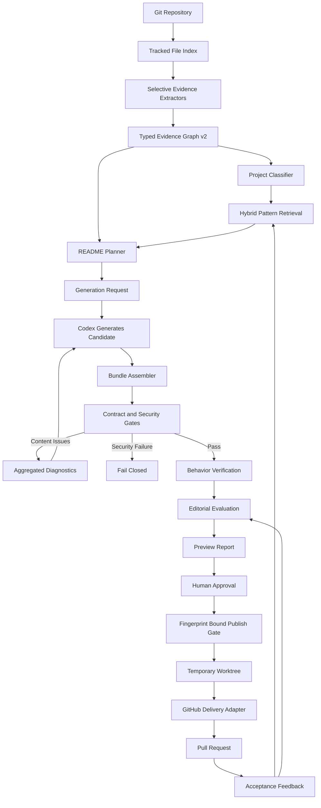

# readme-showcase 架构演进与 Codex 实施规范

> 文档角色：软件架构师 / 技术负责人实施蓝图
> 目标仓库：`Acfufu/readme-showcase`
> 基线来源：当前仓库提交 `b38f780928a7982746965e5ec8673375609e5aa5`
> 适用执行者：Codex 及人工 Reviewer
> 文档状态：已审查；Batch 1 已于 2026-08-02 验收通过
> 范围声明：**明确排除供应链优化、依赖治理、渲染引擎插件化及 ELK 依赖锁升级。**

---

## 执行状态

Batch 1 已按 M0-T1、M0-T2、M0-T3 的依赖顺序完成，后续里程碑尚未开始。

| 任务 | 结果 | 提交 |
|---|---|---|
| 规划矛盾校正 | 完成 | `3877388` |
| M0-T1 架构兼容基线 | 完成 | `1615573` |
| M0-T2 完整测试长尾调查与 CI 边界 | 完成 | `59205a3` |
| M0-T3 通用 Diagnostics 模型 | 完成 | `dfd86de` |

验收结果：

- Python 3.11 与 Python 3.13 完整测试均为 89/89 通过，`npm test` 使用受支持解释器时同样为 89/89；
- 数据集 manifest、英文与中文 README audit、ELK vendor parity、Node 语法、动效 GIF 渲染及 `npm pack --dry-run` 全部通过；
- 未复现历史 90 秒长尾，完整测试约 8 秒结束且无残留测试进程，因此没有引入自定义进程管理 runner；
- v1 CLI、公开 Python 导入、canonical JSON、安装边界及现有 fail-closed 安全行为保持不变；
- 下一执行入口为 Batch 2，开始前应再次确认 M1 的 workspace、stage runner 与 generation request 契约仍与当前代码一致。

---

## 0. Codex 执行指令

你正在改造一个证据驱动、确定性校验、人工审批后发布的 GitHub README Pipeline。

执行时必须遵守以下规则：

1. 按本文档的里程碑顺序执行，不得跳过 M0 基线与兼容性保护。
2. 每个任务必须先阅读目标文件与相关测试，再修改代码。
3. 不允许一次性重写 `pipeline_core.py`；采用“抽取模块 + 保留兼容导出”的渐进式改造。
4. 不得削弱现有安全约束：路径穿越、符号链接、文件类型、哈希、Git 基线、审批指纹、发布权限检查必须保持 fail-closed。
5. 每个任务至少提供一个能捕获其回归的最小测试；每个里程碑覆盖适用的 unit、contract、integration 和 E2E 层。只有新增安全、IO 或 Schema 失败路径时才要求新增稳定错误码；跨阶段 E2E 由拥有完整数据流的里程碑任务负责。
6. 所有 JSON 输出必须继续使用 canonical JSON 和原子写入。
7. 每完成一个任务，执行对应测试；每完成一个里程碑，执行完整测试矩阵。
8. 不要引入数据库、Web 服务、云端 SaaS、模型供应商 SDK 或后台管理 UI。
9. 不要修改 ELK 供应链、包锁、镜像摘要、SRI、引擎来源提交或许可证验证逻辑。
10. 遇到本文档与现有安全测试冲突时，以更严格的约束为准，并记录 ADR。
11. 现有 v1 CLI、公开 Python 导入、错误码和 fail-closed 行为不得因 v2 路径而放宽；需要不同语义时新增 v2 入口。
12. 未知 diagnostic code 默认 fail-fast；不得仅凭错误码前缀判断安全性。

### 建议提交策略

每个任务使用独立提交，提交信息遵循：

```text
feat(orchestration): add resumable run workspace
refactor(scanner): extract tracked-file index
feat(evidence): add evidence schema v2
feat(evaluation): add behavior verification layer
test(ci): isolate slow and integration suites
```

禁止将多个里程碑压缩进一个提交。

---

# 1. 当前代码基线

## 1.1 已确认的仓库状态

| 项目 | 当前值 |
|---|---:|
| `skill/scripts/pipeline_core.py` | 2,694 行 |
| `skill/scripts/readme_pipeline.py` | 254 行 |
| `skill/scripts/pipeline_contracts.py` | 307 行 |
| `skill/SKILL.md` | 231 行 |
| 测试用例 | 82 个 |
| Retrieval 数据记录 | 12 条 |
| Retrieval 训练/测试划分 | 10 / 2 |
| 项目类型 | 4 类 |
| Pipeline CLI 子命令 | 8 个 |

当前 CLI：

```text
validate-dataset
scan
retrieve
validate-bundle
evaluate
import-benchmark
build-pr-bundle
check-publish-gate
```

基线复现命令：

```bash
git rev-parse HEAD
wc -l skill/scripts/pipeline_core.py skill/scripts/readme_pipeline.py \
  skill/scripts/pipeline_contracts.py skill/SKILL.md
python3 -m unittest discover -s tests -v
```

2026-08-02 本机复现结果：82 个测试在 24.337 秒内全部通过。测试数量以 `unittest` 实际 discovery 结果为准，行数统一以 `wc -l` 为准。

## 1.2 已有核心能力

仓库已经实现：

- canonical JSON；
- 原子文件写入；
- 有界文件读取；
- symlink 和路径逃逸防护；
- 仓库证据扫描；
- Retrieval 数据集验证与规则检索；
- README、SVG、资产、claim map 校验；
- ELK 语义源、`.diagram.json` sidecar 与渲染元数据绑定；
- bundle hard gate；
- evaluation report；
- PR bundle 指纹；
- remote state、approval envelope 与 publish gate；
- 离线端到端测试。

## 1.3 主要架构缺口

1. 没有统一的 `run/resume/status` 编排层。
2. 中间 JSON 文件仍由 Agent 手工拼装和维护哈希。
3. Evidence 仅为文件级，无法精准绑定到行、符号、配置项或命令观察结果。
4. Scanner 达到限制时会返回空 `files/facts`，无法部分成功。
5. 大多数内容错误采用首次失败即退出，Agent 修复轮次过多。
6. Evaluation 主要证明“契约合法”，尚不能充分证明“README 可运行、可读、真实”。
7. Retrieval 项目类型和数据量有限，缺少自动分类与离线检索指标。
8. `pipeline_core.py` 承担过多领域职责。
9. 多语言只硬编码 `en` 和 `zh`，并通过文件名猜测图像语言。
10. 发布层只生成写入授权，没有实现受控 GitHub PR 执行器。
11. 主工作区必须完全干净，真实使用成本较高。
12. 没有采集人工接受、拒绝和后续修改结果的反馈闭环。
13. 曾观察到完整测试超过 90 秒，但当前基线未复现；应先重复采样并定位模块级长尾，仅在可复现时增加进程组超时和回收机制。

## 1.4 审查后兼容与安全语义

- 显式输入、输出、workspace、candidate 或 artifact 路径中的 symlink、特殊文件、路径逃逸必须 fail-fast。
- Scanner 在仓库遍历中发现的非候选 symlink、特殊文件、secret 或 binary 保持“不读取 + warning”；资源上限返回 `partial` / `incomplete` 业务状态，但这些状态不得获得发布授权。
- `build_pr_bundle` v1 保留“主工作区和 index 必须干净”的 `E_PR_WORKTREE` 契约。M8 的脏工作区支持只能通过新的 v2 临时 worktree 入口实现。
- README 本地路径、anchor、alt、SVG safety、claim evidence、Git base、approval fingerprint 和 candidate hash 的现有 hard gate 不得降级为可配置 Behavior Gate。
- 所有 artifact/schema 路径统一位于 `skill/schemas/`；其 producer 任务同时拥有 Python validator、valid/invalid fixture 和安装边界，M7 只负责跨实现 parity、CI 与发布清单。

---

# 2. 目标架构



## 2.1 架构原则

### A. 确定性核心与生成能力分离

Pipeline 负责：

- 扫描；
- 状态管理；
- Schema；
- 哈希；
- 校验；
- 评测；
- 交付授权。

Codex 负责：

- 读取 generation request；
- 撰写 README；
- 生成 claim map；
- 生成结构化视觉语义源；
- 根据 diagnostics 修订候选内容。

本仓库不直接集成 OpenAI、Anthropic 或其他模型 SDK。

### B. 安全错误 fail-fast，内容错误聚合

必须立即停止：

- 路径穿越；
- symlink；
- 特殊文件；
- 超出硬限制；
- 哈希漂移；
- 不安全 SVG；
- Git 基线不一致；
- 审批和候选不匹配；
- 发布权限不足。

应聚合返回：

- Markdown 缺少 alt；
- caption 缺失；
- section 缺失；
- claim map 覆盖不足；
- 多语言配对错误；
- 命令未出现；
- 视觉内容与计划不一致；
- 可读性和重复内容问题。

### C. Schema 版本并行迁移

- 现有 `schema_version: 1` 不得直接破坏。
- 新 Evidence、Plan、Claim、Evaluation 使用 v2。
- 先实现 v1 -> v2 读取适配器。
- 一个完整发布周期后再考虑停止生成 v1。

### D. 先局部抽取，再模块化

禁止把 `pipeline_core.py` 一次性替换为新实现。

采用：

```text
原函数
  ↓
移动到新领域模块
  ↓
pipeline_core.py 保留 re-export / wrapper
  ↓
测试全部通过
  ↓
后续调用迁移到新模块
```

---

# 3. 目标目录结构

在不破坏现有入口的前提下新增：

```text
skill/scripts/
├── readme_pipeline.py
├── pipeline_core.py                 # 兼容导出层，逐步变薄
├── pipeline_contracts.py            # 保留 canonical IO 原语
├── readme_showcase/
│   ├── __init__.py
│   ├── diagnostics.py
│   ├── errors.py
│   ├── models.py
│   ├── contracts/
│   │   ├── common.py
│   │   ├── evidence.py
│   │   ├── plan.py
│   │   ├── claims.py
│   │   ├── assets.py
│   │   ├── evaluation.py
│   │   └── publishing.py
│   ├── orchestration/
│   │   ├── runner.py
│   │   ├── state.py
│   │   ├── stages.py
│   │   └── workspace.py
│   ├── scanner/
│   │   ├── git.py
│   │   ├── index.py
│   │   ├── extractors.py
│   │   ├── policies.py
│   │   └── service.py
│   ├── evidence/
│   │   ├── graph.py
│   │   ├── adapters.py
│   │   └── selectors.py
│   ├── retrieval/
│   │   ├── classifier.py
│   │   ├── ranker.py
│   │   ├── metrics.py
│   │   └── service.py
│   ├── generation/
│   │   ├── request.py
│   │   ├── assembler.py
│   │   └── manual_backend.py
│   ├── validation/
│   │   ├── bundle.py
│   │   ├── readme.py
│   │   ├── claims.py
│   │   ├── assets.py
│   │   └── policy.py
│   ├── evaluation/
│   │   ├── contract.py
│   │   ├── behavior.py
│   │   ├── editorial.py
│   │   └── report.py
│   ├── preview/
│   │   ├── report.py
│   │   └── renderer.py
│   └── delivery/
│       ├── bundle.py
│       ├── approval.py
│       ├── worktree.py
│       ├── github.py
│       └── feedback.py
```

公开 Schema 统一放在已由 npm/installer 携带的 `skill/` 边界内：

```text
skill/schemas/
├── repository-scan.v2.schema.json
├── repository-evidence.v2.schema.json
├── retrieval-packet.v2.schema.json
├── readme-plan.v2.schema.json
├── generation-request.v1.schema.json
├── claim-map.v2.schema.json
├── asset-manifest.v2.schema.json
├── generated-bundle.v2.schema.json
├── evaluation-report.v2.schema.json
├── run-manifest.v1.schema.json
└── feedback-event.v1.schema.json
```

测试目录新增：

```text
tests/
├── unit/__init__.py
├── contract/__init__.py
├── integration/__init__.py
├── e2e/__init__.py
└── fixtures/
    ├── repositories/
    ├── evidence-v2/
    ├── bundles-v2/
    └── run-workspaces/
```

现有测试暂不强制移动；新测试按上述结构落位。迁移期 `all` lane 必须继续执行 `python3 -m unittest discover -s tests -v`，确保根目录 82 个 legacy tests 与嵌套测试全部被发现；分层 lane 不能替代该门禁。

## 3.1 Artifact 与 Schema 所有权

| Artifact / Schema | 唯一 producer | 依赖 | M7 职责 |
|---|---|---|---|
| run manifest v1 | M1-T1 | M0 | parity / package audit |
| generation request v1、readme plan v1 | M1-T3 | M1-T1/T2 | parity / package audit |
| repository scan v2 | M2-T3 | M2-T1/T2 | parity / package audit |
| repository evidence v2 | M3-T1 | M2-T1 | parity / package audit |
| retrieval packet v2 | M6-T2 | M3-T2、M6-T1 | parity / package audit |
| readme plan v2、claim map v2、asset manifest v2、generated bundle v2 | M3-T3 | M3-T1/T2、M1-T3 | parity / package audit |
| evaluation report v2 | M5-T2 | M3-T3、M5-T1 | parity / package audit |
| feedback event v1 | M9-T1 | M8 | parity / package audit |

每个 producer 同时交付 Python validator、Draft 2020-12 Schema、valid/invalid fixtures 和 v1 adapter（若存在 v1）。M7-T1 审计截至 M7 已存在的 Schema；M8/M9 后续 producer 在各自任务重复同一 parity/package gate，不回头修改 M7。

---

# 4. 里程碑总览

| 里程碑 | 优先级 | 核心结果 |
|---|---|---|
| M0 | P0 | 基线、测试隔离、模块抽取保护 |
| M1 | P0 | 可恢复的 `run/resume/status/explain` 编排层 |
| M2 | P0 | Scanner v2 与部分成功模型 |
| M3 | P0 | Evidence v2 与多证据 Claim |
| M4 | P0 | 聚合诊断与自动修复循环输入 |
| M5 | P1 | 三层评测与行为验证 |
| M6 | P1 | Retrieval 自动分类、混合排序和基准 |
| M7 | P1 | JSON Schema 发布与多语言泛化 |
| M8 | P2 | 临时 worktree 与 GitHub PR 执行器 |
| M9 | P2 | 接受反馈与本地数据飞轮 |

## 4.1 执行依赖图

里程碑编号表示领域分组，不表示所有任务可仅按编号直线执行。Trellis child 必须在自身 `prd.md` / `implement.md` 重复依赖：

```text
M0-T1 -> M0-T2
      \-> M0-T3

M1-T1 -> M1-T2 -> M1-T3
M2-T1 -> M2-T2 -> M2-T3
M2-T1 -> M3-T1 -> M3-T2 -> M3-T3
M1-T3 ----------------------^
M0-T3 + M3-T3 -> M4-T1 -> M4-T2
M3-T3 -> M5-T1/M5-T2; M1-T3 -> M5-T3
M4-T1 + M5-T1/T2/T3 -> M5-T4
M3-T2 -> M6-T1 -> M6-T2 -> M6-T3 -> M6-T4
schema producers through M6 -> M7-T1 parity -> M7-T2 locale validation
M0-T1 -> M8-T1; M3-T3 + M4-T1 -> M8-T3
M8-T1 + M8-T3 + M5-T4 + M7-T1 -> M8-T2
M8-T2 -> M9-T1 -> M9-T2
```

Batch 内仅在依赖满足时并行；M6-T4 是独立的许可证/人工审核 curation 工作，不与 ranker 代码合并。

---

# 5. M0：基线与演进护栏

## M0-T1：增加架构基线测试

### 修改文件

- 新增 `tests/contract/test_architecture_baseline.py`
- 修改 `.github/workflows/ci.yml`

### 任务

建立以下不可回退的基线断言：

1. 现有 8 个 CLI 子命令仍存在。
2. `pipeline_core.py` 中现有公开函数仍可导入。
3. canonical JSON 字节输出不变。
4. 现有错误码保留。
5. v1 bundle、evaluation、PR bundle、approval fixture 继续通过。
6. 公开符号清单至少包含第 15.1 节函数及 `segment_markdown_blocks`。
7. `pipeline_core.py` 只允许逐里程碑下降，不允许继续增长超过基线 2,694 行；初期先记录，不立即阻断。

### 验收标准

- 新测试能够识别 CLI 删除、公开函数丢失和 canonical 输出漂移。
- 不修改现有 fixture 即可通过。

---

## M0-T2：调查并隔离完整测试套件长尾问题

### 修改文件（仅在复现结果需要时新增）

- `.github/workflows/ci.yml`
- 可选新增 `scripts/run_test_suite.py`
- 可选新增 `tests/contract/test_test_harness.py`

### 实现要求

先连续运行完整 suite 和各测试模块至少 3 次，记录模块、开始/结束、耗时、退出码和残留进程。若无法复现挂起，保留现有 `unittest` 入口，只增加 CI lane 计时与结果归属；不得为假设中的故障引入自定义 runner。

只有复现模块挂起或遗留子进程时，才实现测试运行器：

```bash
python scripts/run_test_suite.py --suite unit --timeout 120
python scripts/run_test_suite.py --suite integration --timeout 300
python scripts/run_test_suite.py --suite all --timeout 600
```

运行器必须：

- 为每个测试模块设置超时；
- 记录开始、结束和耗时；
- 超时时输出 Python faulthandler；
- 尝试打印子进程树；
- 确保超时后杀死进程组；
- 输出最慢 10 个模块；
- 返回稳定退出码。

CI 拆分：

```text
python-contract
python-unit
python-integration
python-e2e
legacy-all
node-elk
motion
npm-package
```

说明：本任务不是删减测试，也不是默认重写 runner。`legacy-all` 始终是必过门禁；分层 lane 负责诊断和并行反馈，不能漏掉或替代根目录测试。

### 验收标准

- 报告明确记录历史 90 秒问题是否复现，以及重复采样证据。
- 若实现 runner，任意模块挂起时 CI 在设定时间内结束并输出诊断；未复现时不得添加未使用的进程管理抽象。
- 运行完成后无遗留 `python -m unittest`、Node 或渲染子进程。
- 单模块和完整套件执行顺序均可复现。
- `legacy-all` 覆盖当前 82 个根测试及新增嵌套测试。

---

## M0-T3：抽取通用 Diagnostics 模型

### 新增文件

- `skill/scripts/readme_showcase/diagnostics.py`
- `skill/scripts/readme_showcase/errors.py`
- `tests/unit/test_diagnostics.py`

### 数据结构

```python
@dataclass(frozen=True, slots=True)
class Diagnostic:
    code: str
    severity: Literal["error", "warning", "info"]
    category: Literal["security", "contract", "content", "behavior", "editorial"]
    message: str
    path: str | None = None
    line: int | None = None
    related_ids: tuple[str, ...] = ()
    suggested_action: str | None = None
```

```python
@dataclass(frozen=True, slots=True)
class DiagnosticReport:
    status: Literal["pass", "fail"]
    diagnostics: tuple[Diagnostic, ...]
```

实现：

- 稳定排序：`severity -> code -> path -> line -> message`；
- 去重；
- canonical JSON 投影；
- 安全类错误转 `ContractError` 的适配器；
- 内容类错误聚合适配器。

### 验收标准

- 同一批 diagnostics 不受发现顺序影响。
- 相同输入生成相同 SHA-256。
- 现有 `ContractError` 调用无需立即全部迁移。

---

# 6. M1：可恢复 Pipeline Orchestrator

## 6.1 新 CLI

在 `skill/scripts/readme_pipeline.py` 新增：

```text
run
resume
status
explain
```

`preview` CLI 由 M5-T4 拥有；M1 不提供占位实现。

### 命令草案

```bash
python skill/scripts/readme_pipeline.py run \
  --root . \
  --workspace /tmp/readme-showcase-run \
  --mode readme \
  --project-type developer-tool \
  --locale en \
  --locale zh-Hans \
  --stop-after generation-request
```

```bash
python skill/scripts/readme_pipeline.py resume \
  --workspace /tmp/readme-showcase-run
```

```bash
python skill/scripts/readme_pipeline.py status \
  --workspace /tmp/readme-showcase-run
```

```bash
python skill/scripts/readme_pipeline.py explain \
  --workspace /tmp/readme-showcase-run \
  --format json
```

## M1-T1：Run Workspace

### 新增文件

- `skill/scripts/readme_showcase/orchestration/workspace.py`
- `skill/scripts/readme_showcase/orchestration/state.py`
- `skill/schemas/run-manifest.v1.schema.json`
- `tests/contract/test_run_manifest.py`

### Workspace 布局

```text
<workspace>/
├── run-manifest.json
├── inputs/
├── stages/
│   ├── 01-scan/
│   ├── 02-retrieve/
│   ├── 03-plan-import/
│   ├── 04-generation-request/
│   ├── 05-candidate/
│   ├── 06-bundle-assemble/
│   ├── 07-validation/
│   └── 08-evaluation/
├── diagnostics/
└── output/
```

### Run manifest

```json
{
  "schema_version": 1,
  "run_id": "sha256-derived-id",
  "created_at": "2026-08-02T00:00:00Z",
  "updated_at": "2026-08-02T00:00:00Z",
  "target": {
    "root": "/absolute/path",
    "repository": "owner/name",
    "base_sha": "40-char-sha"
  },
  "configuration": {
    "mode": "readme",
    "project_type": "developer-tool",
    "locales": ["en", "zh-Hans"],
    "scanner_profile": "balanced"
  },
  "current_stage": "generation-request",
  "stages": [
    {
      "name": "scan",
      "status": "pass",
      "input_sha256": "...",
      "output_sha256": "...",
      "attempt": 1,
      "started_at": "...",
      "completed_at": "..."
    }
  ]
}
```

### 约束

- workspace 必须位于目标仓库外部；
- 不允许 symlink workspace；
- 每个阶段输出写入临时目录后原子替换；
- stage 输入哈希变化时自动使下游阶段 stale；
- resume 只从第一个 stale/failed/pending 阶段继续；
- run manifest 中不得保存 token、凭据或环境变量值。

### 验收标准

- 相同目标、配置和 base SHA 生成相同 `run_id`。
- 中断后重新执行 `resume` 不重复已通过阶段。
- stage invalidation 纯函数能按输入 hash 标记 stale；candidate 级联验收归 M1-T2。
- 修改 target base SHA 后 scan 及所有下游阶段失效。

---

## M1-T2：Stage Runner

### 新增文件

- `skill/scripts/readme_showcase/orchestration/stages.py`
- `skill/scripts/readme_showcase/orchestration/runner.py`
- `tests/e2e/test_resumable_pipeline.py`

### Stage 协议

```python
class Stage(Protocol):
    name: str

    def fingerprint(self, context: RunContext) -> str: ...
    def execute(self, context: RunContext) -> StageResult: ...
```

### 初期阶段

M1 只编排现有 v1 能力，不实现 M3 Evidence v2、M5 Preview 或 M6 Classifier：

1. `scan`
2. `retrieve`
3. `plan-import`
4. `generation-request`
5. `candidate-import`
6. `bundle-assemble`
7. `validate`
8. `evaluate`

`plan-import` 接受人工提供、通过 v1 contract 的 plan；缺失时返回 `waiting-for-plan`。后续 M3/M6 通过新增 stage adapter 接入 evidence/classification，不回填隐式 placeholder。

### 重要边界

`generation-request` 后 Pipeline 可以暂停，等待 Codex 在规定路径写入：

```text
stages/05-candidate/README.md
stages/05-candidate/README_zh.md
stages/05-candidate/claim-map.json
stages/05-candidate/asset-manifest.json
stages/05-candidate/assets/**
```

Pipeline 不直接调用模型 API。

### 验收标准

- `run --stop-after generation-request` 成功输出完整 generation request。
- Candidate 缺失时 `resume` 返回明确状态 `waiting-for-candidate`，不是异常退出。
- Candidate 齐全后 `resume` 自动组装、验证和评测；预览由 M5-T4 接入。
- 修改 candidate 后仅 bundle assemble、validation、evaluation 及后续已安装 stages 失效。
- 阶段重复执行结果字节一致。

---

## M1-T3：Generation Request

### 新增文件

- `skill/scripts/readme_showcase/generation/request.py`
- `skill/schemas/generation-request.v1.schema.json`
- `tests/contract/test_generation_request.py`

### 必须包含

```json
{
  "schema_version": 1,
  "mode": "readme",
  "target": {
    "repository": "owner/name",
    "base_sha": "..."
  },
  "locales": ["en", "zh-Hans"],
  "project_classification": null,
  "plan": {},
  "retrieval_records": [],
  "evidence_index": [],
  "output_contract": {
    "required_files": [],
    "schemas": {},
    "forbidden_paths": []
  },
  "revision_context": null
}
```

不得把所有源文件全文复制进 generation request。只提供：

- 选中的事实；
- 必要代码片段；
- 结构索引；
- 计划；
- 相关 retrieval patterns；
- 输出契约。

### 验收标准

- generation request 大小有明确上限。
- 每条事实均可通过 ID 回溯到现有 v1 evidence packet；v2 locator 由 M3 接入。
- 不包含 excluded directory 内容。
- canonical 输出稳定。

---

# 7. M2：Scanner v2

## M2-T1：Tracked File Index

### 修改/新增

- 从 `pipeline_core.py::scan_repository` 抽取到：
  - `scanner/git.py`
  - `scanner/index.py`
  - `scanner/service.py`
- 新增 `tests/unit/scanner/test_git_index.py`

### 默认行为

优先执行：

```bash
git -c core.fsmonitor=false ls-files -z --cached
```

在明确配置时才包含：

```bash
git ls-files -z --others --exclude-standard
```

### Index 字段

```json
{
  "path": "src/app.py",
  "bytes": 1024,
  "sha256": "...",
  "language": "python",
  "role": "source",
  "tracked": true,
  "selected_for_content": false
}
```

`role` 允许：

```text
readme
documentation
manifest
source
test
workflow
configuration
example
asset
other
```

### 验收标准

- 默认不读取未跟踪文件内容。
- packed refs、worktree `.git` 文件和普通 `.git` 目录均可解析 base SHA。
- fsmonitor 不被执行。
- 文件顺序稳定。

---

## M2-T2：Scanner Profiles

### 新增

- `scanner/policies.py`
- `tests/unit/scanner/test_profiles.py`

支持：

```text
fast
balanced
deep
```

默认参数建议：

| Profile | 索引文件 | 内容文件 | 总内容上限 | 超时 |
|---|---:|---:|---:|---:|
| fast | 5,000 | 50 | 2 MB | 5s |
| balanced | 20,000 | 250 | 16 MB | 20s |
| deep | 100,000 | 1,000 | 64 MB | 60s |

支持仓库配置（使用 Python 标准库 JSON；YAML 需要单独的依赖治理授权，不在本轮范围）：

```json
{
  "scanner": {
    "tracked_only": true,
    "profile": "balanced",
    "include": ["src/**", "docs/**"],
    "exclude": ["tests/fixtures/generated/**"],
    "secret_policy": "redact"
  }
}
```

配置文件名称固定为：

```text
.readme-showcase.json
```

### 验收标准

- 配置未知字段 fail-closed。
- include/exclude 使用 POSIX 路径规则。
- 配置不能绕过固定安全排除目录。
- profile 覆盖值必须在全局硬上限内。

---

## M2-T3：部分成功扫描

### 新增

- `skill/schemas/repository-scan.v2.schema.json`
- `tests/contract/test_repository_scan_v2.py`

### 当前问题

现有 `_incomplete_scan()` 会清空已收集的 `files` 和 `facts`。

### 新状态

```text
complete
partial
incomplete
```

语义：

- `complete`：计划范围内全部处理完成；
- `partial`：已产生可用证据，但存在被跳过项；
- `incomplete`：缺少项目类型 policy table 规定的最低证据集合，停止生成。

### 输出结构

```json
{
  "schema_version": 2,
  "status": "partial",
  "coverage": {
    "tracked_files": 3200,
    "indexed_files": 3200,
    "selected_files": 184,
    "content_files": 180,
    "skipped_files": 4,
    "content_bytes": 1442000
  },
  "skipped": [
    {
      "path": "generated/large.js",
      "reason": "file-size-limit",
      "required_for_generation": false
    }
  ],
  "warnings": []
}
```

### 继续执行策略

关键证据由项目类型 policy table 定义，禁止用“足够”或“关键”自由判断：

| 项目类型 | 最低证据集合 | `partial` 允许模式 | 自动发布 |
|---|---|---|---|
| CLI / library | manifest、install entry、最小 usage/test observation | audit、readme | 禁止，需人工复核 |
| app / extension | manifest、entrypoint、install artifact 或真实运行入口 | audit、readme | 禁止，需人工复核 |
| service | manifest、entrypoint、deploy/health contract | audit、readme | 禁止，需人工复核 |
| unknown | README、manifest | audit-only | 禁止 |

任何最低证据缺失均为 `incomplete`；`partial` 永远不能直接进入 publish gate。

### 验收标准

- 达到单文件限制不会丢弃其他证据。
- coverage 数字可验证且稳定。
- continuation policy 有独立测试。

---

# 8. M3：Evidence v2

## M3-T1：发布 Evidence v2 Schema

### 新增

- `skill/schemas/repository-evidence.v2.schema.json`
- `contracts/evidence.py`
- `evidence/adapters.py`
- `tests/contract/test_evidence_v2.py`

### Evidence Fact

```json
{
  "fact_id": "config:python-supported-versions",
  "kind": "config-value",
  "source": {
    "path": ".github/workflows/ci.yml",
    "line_start": 18,
    "line_end": 18,
    "symbol": null,
    "json_pointer": null
  },
  "value": ["3.10", "3.11", "3.12", "3.13"],
  "source_sha256": "...",
  "evidence_sha256": "...",
  "confidence": "observed"
}
```

### `kind` 枚举

```text
file-presence
file-snippet
config-value
package-metadata
code-symbol
cli-entrypoint
test-observation
command-observation
git-metadata
documentation-statement
```

### `confidence` 枚举

```text
observed
derived
documented
```

规则：

- `observed` 可直接用于强事实声明；
- `derived` 必须记录 derivation；
- `documented` 只能表达文档声称，不等价于行为已验证。

### 兼容适配

`source` locator 必须满足 Draft 2020-12 `oneOf`：

- 行定位：同时提供 1-based、闭区间的 `line_start` / `line_end`，且 `line_start <= line_end`；
- symbol 定位：提供规范化的语言内 qualified name，不同时提供行区间；
- config 定位：提供 RFC 6901 JSON Pointer，不同时提供 symbol 或行区间；
- 仅 `file-presence` 可以没有细粒度 locator。

`fact_id` 由 `kind + normalized path + normalized locator + semantic key` 的 canonical JSON SHA-256 派生，并保留可读前缀；同一 packet 内碰撞返回 `E_FACT_DUPLICATE`。`source_sha256` 绑定源文件字节，`evidence_sha256` 绑定去除自身 hash 字段后的规范化事实语义。

v1 文件事实：

```text
file:README.md
```

适配成 v2：

```text
kind=file-presence
confidence=observed
```

### 验收标准

- v1 evidence 可读且可转为规范化 v2。
- v2 不允许模糊 source range。
- fact ID 稳定且唯一。
- `evidence_sha256` 绑定事实语义内容，不只绑定整个文件。

---

## M3-T2：选择性 Extractors

### 新增

- `scanner/extractors.py`
- `tests/unit/scanner/test_extractors.py`

初期实现以下 extractor：

1. `ReadmeExtractor`
2. `PythonProjectExtractor`
3. `NodeProjectExtractor`
4. `GitHubActionsExtractor`
5. `CliEntrypointExtractor`
6. `TestLayoutExtractor`
7. `GenericConfigExtractor`

输出示例：

```text
pyproject.toml -> package name / Python requirement / scripts
package.json -> name / bin / engines / scripts
ci.yml -> OS matrix / runtime matrix / commands
tests -> test framework / test count / key integration tests
```

### 约束

- 不执行仓库代码；
- 不导入目标包；
- 优先使用标准库解析器；
- 解析失败返回 warning，不自动猜测；
- 所有片段记录行号与源文件哈希。

### 验收标准

- 对仓库自身可提取 Python 3.10–3.13、Linux/macOS、CLI bin、测试数量等事实。
- 解析器对格式变化有 fixture 覆盖。
- 不读取 secret 文件内容。

---

## M3-T3：多证据 Claim Map v2

### 新增

- `skill/schemas/readme-plan.v2.schema.json`
- `skill/schemas/claim-map.v2.schema.json`
- `skill/schemas/asset-manifest.v2.schema.json`
- `skill/schemas/generated-bundle.v2.schema.json`
- 对应 Python validators、valid/invalid fixtures 和 v1 readers

### Schema

```json
{
  "claim_id": "markdown:en:runtime-support",
  "content_sha256": "...",
  "claim_kind": "factual",
  "evidence_ids": [
    "config:python-supported-versions",
    "config:ci-operating-systems"
  ],
  "language_pair_id": "runtime-support",
  "support_level": "direct"
}
```

移除 v2 claim 中单一：

```text
truth_id
evidence_sha256
```

由 `evidence_ids` 替代。每个 ID 自带语义 hash。

### `support_level`

```text
direct
composed
documented-only
```

### 验收标准

- 一个 claim 可以绑定 1..N 条证据。
- `composed` claim 至少需要 2 条证据。
- 双语 claim 必须使用相同证据集合和 support level。
- v1 claim map 可以通过 adapter 读取。
- 发布 bundle 内只生成 v2。

---

# 9. M4：聚合诊断和修订循环

## M4-T1：Validation Policy

### 新增

- `validation/policy.py`
- `validation/bundle.py`
- `tests/unit/validation/test_policy.py`

分类必须使用当前公开错误码的显式表，禁止前缀匹配。首批不可聚合集合至少固定以下现有 codes；表外 code 默认 fail-fast：

```python
FAIL_FAST_CODES = {
    "E_PATH",
    "E_INPUT_PATH",
    "E_OUTPUT_PATH",
    "E_PR_PATH",
    "E_PUBLISH_PATH",
    "E_BUNDLE_HASH",
    "E_SHA256",
    "E_SVG_UNSAFE",
    "E_ENGINE_METADATA",
    "E_CLAIM_EVIDENCE",
    "E_DATASET_SPLIT_LEAK",
    "E_PR_BASE",
    "E_PR_GIT",
    "E_PR_INDEX",
    "E_PR_WORKTREE",
    "E_CANDIDATE_DRIFT",
    "E_EVALUATION_DRIFT",
    "E_APPROVAL_FINGERPRINT",
    "E_REMOTE_PERMISSION",
}

AGGREGATABLE_CODES = {
    "E_README_COMMAND",
    "E_README_LANGUAGE",
    "E_README_ACCESSIBILITY",
    "E_CLAIM_COVERAGE",
    "E_CLAIM_LANGUAGE",
}
```

实现前从 M0 的错误码快照生成完整人工审核清单；新增 code 必须在同一 change 中显式分类，否则按 fail-fast 处理。

### 输出

```json
{
  "schema_version": 1,
  "status": "fail",
  "diagnostics": [
    {
      "code": "E_README_COMMAND",
      "severity": "error",
      "category": "content",
      "path": "README.md",
      "line": 42,
      "message": "Planned quick-start command is missing",
      "suggested_action": "Insert the command from readme-plan.json"
    }
  ]
}
```

### 验收标准

- 一次验证能返回多个独立内容问题。
- 遇到安全问题时不继续扫描其他候选资产。
- diagnostics 稳定排序并可重复哈希。

---

## M4-T2：Revision Context

Validation 失败后自动生成：

```text
stages/04-generation-request/revisions/<attempt>/revision-request.json
```

内容：

- 原 generation request hash；
- 候选 hash；
- diagnostics；
- 允许修改的文件；
- 禁止修改的证据和计划；
- attempt number。

### 规则

- 默认最大修订次数 3；
- 超过后状态变为 `manual-review-required`；
- 每次修订保存前后 candidate hash；
- 不覆盖历史 attempt。
- run manifest 只保存当前 attempt 的相对引用；`attempt` 为从 1 开始的连续整数，已存在目录时拒绝覆盖。

### 验收标准

- Agent 可仅根据 revision request 完成定向修复。
- 修订后未改变的上游阶段不重跑。
- 任何证据或计划变化会触发新的 generation request，而不是 revision。

---

# 10. M5：Evaluation v2

## 10.1 三层评测

| 层级 | 目标 | 默认是否阻断 |
|---|---|---:|
| Contract Gate | Schema、安全、哈希、证据存在 | 是 |
| Behavior Gate | 新增命令 observation 与可观察行为；不包含既有 README/SVG/evidence hard gates | 可配置 |
| Editorial Review | 可读性、信息架构、视觉价值 | 否，要求人工确认 |

---

## M5-T1：修正现有 Advisory 指标

当前指标不得再使用“只要资产存在就算 visual provenance 满分”等退化逻辑。

所有 ratio 输出统一为 `{covered, total, status}`：`total == 0` 时 `status="not-applicable"`，不计为满分或零分；否则 `status="measured"`。不得输出 float。

重新定义：

### `claim_coverage`

```text
有证据支持的 factual claims / factual claims 总数
```

### `diagram_label_coverage`

```text
有证据绑定的可见 diagram labels / 可见 diagram labels 总数
```

### `evidence_sources`

```text
被 claim 实际使用的独立 source path 数量
```

### `observable_commands`

```text
验证成功的命令数 / 计划命令数
```

### `visual_provenance`

```text
所有非装饰视觉中，truth_ids/evidence_ids 完整且可验证的数量 / 非装饰视觉总数
```

### 验收标准

- 构造不同质量 bundle 时指标能产生不同结果。
- 指标不能因为 hard gate 已通过而天然全部满分。
- 指标分子分母和失败原因均写入 report。

---

## M5-T2：Behavior Verification

### 新增

- `evaluation/behavior.py`
- `skill/schemas/evaluation-report.v2.schema.json`
- `tests/integration/test_behavior_evaluation.py`

初期支持：

1. 复用现有 hard gate 的本地 Markdown 链接、内部 anchor 与 README/plan 命令一致性结果，不降低其阻断级别；
4. 可选命令观察结果导入；
5. 安装/quick-start 示例静态一致性；
6. 文件路径和配置样例存在性。

命令不得默认直接执行。使用 observation envelope：

```json
{
  "schema_version": 1,
  "command_id": "quick-start:validate-dataset",
  "command": "python skill/scripts/readme_pipeline.py validate-dataset ...",
  "cwd": ".",
  "exit_code": 0,
  "stdout_sha256": "...",
  "stderr_sha256": "...",
  "observed_at_base_sha": "...",
  "runner": "human-or-ci",
  "verification": "imported-unverified"
}
```

Pipeline 只验证 envelope 的结构和绑定关系。未认证的人工作业只能标为 `imported-unverified` advisory；只有受控 CI runner 生成且同时绑定 base SHA、command、cwd、input hashes 的 envelope 才能标为 `verified`。本轮不实现签名或远程认证。

### 验收标准

- 没有 observation 时报告 `not-observed`，不得伪造 pass。
- observation base SHA 不一致时失效。
- 命令文本漂移时失效。
- 未认证 observation 不能产生 Behavior pass。

---

## M5-T3：Editorial Evaluation

### 新增

- `evaluation/editorial.py`
- `tests/unit/evaluation/test_editorial.py`

先实现确定性启发式：

- 首屏是否包含项目定义和主要行动入口；
- heading 层级；
- 重复段落；
- 超长段落；
- 过多 badge；
- 相邻图片无说明；
- quick start 距离顶部过远；
- section 与 plan 的覆盖；
- 双语结构一致性；
- README diff 大小。

首版固定阈值，不增加配置项：段落超过 600 个 Unicode code points 为超长；badge 超过 8 个为过多；Quick Start 首次出现晚于第 120 个非空行时提示；单文件 diff 超过 500 行时提示人工复核。无适用对象的规则输出 `not-applicable`。

输出 advisory，不自动发布失败。

为未来 LLM Judge 预留可导入的 judge report Schema，但本里程碑不集成模型调用。

### 验收标准

- 结果完全确定性。
- 每个 finding 给出 path/heading/line。
- 不将主观启发式升级为安全 hard gate。

---

## M5-T4：Preview Report

### 新增

- `preview/report.py`
- `preview/renderer.py`
- `tests/e2e/test_preview_report.py`

输出静态目录：

```text
output/preview/
├── index.html
├── report.json
├── README.escaped.html
├── README_zh.escaped.html
└── assets/**
```

要求：

- 无外部网络资源；
- 不执行候选 HTML/JS；
- 首版只以 HTML-escaped `<pre>` 展示 Markdown 源文、diff 和 report，不实现 Markdown renderer；真实 Markdown 渲染需要单独依赖授权任务；
- 展示 old/new diff；
- 展示 evidence links；
- 展示 diagnostics；
- 提供桌面宽度和移动宽度静态预览；
- 预览目录永不进入 PR candidate。

### 验收标准

- 所有内容可离线打开。
- 候选中的脚本和危险 HTML 被转义。
- 相同输入生成相同 report JSON；HTML 中时间字段使用 run manifest 固定值。

---

# 11. M6：Retrieval v2

## M6-T1：自动项目分类

### 新增

- `retrieval/classifier.py`
- `tests/unit/retrieval/test_classifier.py`

扩展项目类型：

```text
cli
sdk
library
api-service
web-app
mobile-app
desktop-app
github-action
monorepo
ml-model
dataset
infrastructure
plugin
template
runtime-toolchain
developer-tool
web-framework
unknown
```

分类输入只能使用 evidence/index，不读取 benchmark gold 数据。

输出：

```json
{
  "primary": "cli",
  "secondary": ["developer-tool"],
  "confidence_basis_points": 9200,
  "reasons": [
    "package.json defines bin.readme-showcase",
    "repository contains argparse CLI"
  ]
}
```

置信度低于固定阈值 6000 basis points 时使用 `unknown` 并要求人工选择。所有 JSON score 使用 0..10000 整数，禁止 float。

### 验收标准

- 对 fixtures 有确定性分类。
- 理由必须绑定 evidence IDs。
- 不允许只根据仓库名称分类。

---

## M6-T2：混合排序

### 新增

- `retrieval/ranker.py`
- `retrieval/metrics.py`
- `skill/schemas/retrieval-packet.v2.schema.json`
- `tests/unit/retrieval/test_ranker.py`

排序信号：

```text
项目类型匹配
section intent overlap
tag overlap
manifest feature overlap
BM25 文本相似度
结果多样性 MMR
```

不得在本阶段引入向量数据库。

确定性参数固定为：Unicode NFKC + casefold；拉丁/数字/下划线按连续 token，CJK 按 code-point bigram；BM25 `k1=120/100`、`b=75/100`；MMR `lambda=70/100`、`k=5`。内部计算使用整数或 `fractions.Fraction`，输出四舍五入为 basis points。同分最终按 `record_id` 升序。

输出每条 record 的解释：

```json
{
  "record_id": "...",
  "score_basis_points": 8700,
  "signals": {
    "project_type_basis_points": 10000,
    "section_overlap_basis_points": 8000,
    "tag_overlap_basis_points": 5000,
    "bm25_basis_points": 7200,
    "diversity_penalty_basis_points": 1000
  }
}
```

### 验收标准

- 排名稳定。
- 同分时使用 `record_id` 排序。
- MMR 能避免返回结构完全重复的 patterns。

---

## M6-T3：离线基准 Harness

### 修改

- 新增 `dataset/retrieval/queries.json`
- 新增 `tests/test_retrieval_benchmark.py`

先为现有 12 条记录和四个现有主要项目类型建立人工审核 gold queries、Project Type Accuracy、Recall@5、MRR、nDCG@5、Section Intent Coverage 与 Pattern Diversity 基线。阈值等于首次审核通过的基线减去 200 basis points；任何测试来源身份出现在 production 输出时无条件失败。

### 验收标准

- CI 记录整数指标、分子、分母和固定阈值。
- 相同 manifest/query bytes 产生相同排名和报告。
- 测试集记录不得进入 production retrieval 输出。

---

## M6-T4：分批扩展数据集

### 修改

- `dataset/retrieval/manifest.json`
- `dataset/README.md`

数据集目标：

- 首批主要类型仅为当前已有的 `developer-tool`、`library`、`runtime-toolchain`、`web-framework`，每类至少 5 条人工审核记录；新增项目类型另开 curation task；
- train/test 严格按来源身份隔离；
- 增加字段：项目规模、用户角色、安装方式、是否 UI、多包、主要 README 目标；
- 保持来源许可证和人工审核要求。

### 验收标准

- 每条新增记录有 pinned commit、material hash、SPDX/license evidence 和人工审核记录。
- M6-T3 的整数指标不低于固定阈值。
- 测试集记录不得进入 production retrieval 输出。

---

# 12. M7：Schema 与多语言泛化

## M7-T1：发布 JSON Schema

### 任务

审计前述 producer 已落地的 `skill/schemas/*.schema.json`，补齐跨实现 parity、CI example validation、installer/npm package 可见性；不得在本任务重复定义 artifact 字段。

### 实现要求

- Schema 使用 Draft 2020-12；
- 关闭未声明字段；
- 定义字符串长度、枚举、路径格式、hash pattern；
- Python 验证器和 JSON Schema fixture 必须保持一致；
- CI 增加 Schema example validation；
- Schema 位于现有 `skill` package 边界内，并由 installer/npm tarball 字节一致地携带。

### 验收标准

- 每个 Schema 至少有 valid/invalid fixture。
- Python validator 与 JSON Schema 对 fixture 结论一致。
- Codex 可只读取 Schema 确定输出字段。

---

## M7-T2：BCP 47 Locale

### 修改

- `contracts/plan.py`
- `contracts/claims.py`
- `validation/readme.py`
- `validation/assets.py`
- `SKILL.md`

支持：

```text
en
zh-Hans
zh-Hant
ja
ko
fr
de
```

不硬编码上限，使用受限 BCP 47 parser。

Asset manifest v2 必须显式声明：

```json
{
  "path": "assets/readme/workflow.zh-Hans.svg",
  "locale": "zh-Hans",
  "language_neutral": false
}
```

禁止继续通过 `-zh.`、`_zh.`、`/zh/` 猜测语言。

### README 配对

Plan 显式声明：

```json
{
  "locales": [
    {"tag": "en", "readme_path": "README.md"},
    {"tag": "zh-Hans", "readme_path": "README_zh.md"}
  ]
}
```

### 验收标准

- 现有 `README.md` + `README_zh.md` v1 bundle 继续可读。
- v2 使用显式 locale。
- 语言配对由 semantic pair ID 完成，不依赖文件名。

---

# 13. M8：GitHub Delivery 闭环

## M8-T1：临时 Worktree

### 新增

- `delivery/worktree.py`
- `tests/integration/test_delivery_worktree.py`

执行：

```bash
git worktree add --detach <temp-path> <base-sha>
```

约束：

- worktree 必须位于目标仓库外；
- 基于 bundle 中固定 base SHA；
- 通过新的 v2 `prepare-delivery-worktree` 路径创建；不得修改或放宽 v1 `build_pr_bundle` 的 `E_PR_WORKTREE` 行为；
- 所有 candidate 应用、diff、commit 准备在临时 worktree；
- 主工作区不再要求完全干净；
- evidence、before bytes 和 candidate base 只读取 immutable commit object / detached worktree，不允许读取主工作区未提交内容；
- 结束后可靠清理；失败时可保留用于审计，但路径写入 result。

### 验收标准

- 主工作区有无关未提交改动时仍能创建候选 PR bundle。
- 主工作区 index 和文件字节不变。
- base SHA 不存在时 fail-closed。
- worktree 中出现额外文件时拒绝发布。

---

## M8-T2：GitHub Delivery Adapter

### 新增

- `delivery/github.py`
- `tests/unit/delivery/test_github_adapter.py`
- `tests/e2e/test_delivery_dry_run.py`

### CLI

```bash
readme_pipeline.py deliver \
  --publish-authority authority.json \
  --transport gh \
  --dry-run
```

初期 transport 只使用 `gh` CLI。只有出现第二个真实 transport 时才抽取 connector abstraction。

首版直接提供 `gh` 具体实现，不为单一 transport 创建抽象接口；网络调用仍与 publish gate 分离：

```python
def verify_remote_with_gh(authority: WriteAuthority) -> RemoteState: ...
def deliver_with_gh(
    authority: WriteAuthority,
    worktree: Path,
    metadata: PRMetadata,
) -> DeliveryResult: ...
```

每个网络动作前重新验证：

- repository；
- base SHA；
- branch；
- branch 不存在；
- candidate hash；
- evaluation hash；
- approval fingerprint；
- permissions。

### 幂等性

- 使用 fingerprint 作为本地 operation ID；
- 重试前读取远程状态；
- 已创建相同 commit/PR 时返回现有结果；
- 不允许覆盖不同内容的同名分支。

### 验收标准

- `--dry-run` 不产生网络写入，只返回 planned branch、candidate tree hash、PR title/body metadata 和 fingerprint；不伪造 commit SHA、PR URL 或 number。
- mock transport 覆盖每个失败步骤。
- 任一绑定字段漂移立即撤销写入权限。
- execute 成功结果包含 branch、commit SHA、PR URL/number 和 fingerprint。

---

## M8-T3：审批预览与操作边界

新增 approval template 生成命令：

```bash
readme_pipeline.py create-approval-template \
  --pr-bundle pr-bundle.json \
  --output approval-envelope.json
```

模板默认：

```json
{
  "decision": "reject"
}
```

用户或上层系统必须显式改为 `approve`。

### 验收标准

- approval 模板自动填充 repository、base SHA、branch、fingerprint、candidate hashes。
- 默认永远不是 approve。
- 修改 candidate 后旧 approval 失效。

---

# 14. M9：接受反馈闭环

## M9-T1：Feedback Event

### 新增

- `skill/schemas/feedback-event.v1.schema.json`
- `delivery/feedback.py`
- `tests/contract/test_feedback_event.py`

事件：

```json
{
  "schema_version": 1,
  "event_id": "sha256-derived-id",
  "run_id": "...",
  "fingerprint": "...",
  "event": "pr-merged",
  "recorded_at": "...",
  "details": {
    "accepted_files": ["README.md"],
    "rejected_assets": [],
    "manual_edit_distance": {"changed": 17, "total": 100},
    "pr_number": 42
  }
}
```

事件枚举：

```text
preview-approved
preview-rejected
pr-opened
pr-closed
pr-merged
candidate-edited
asset-rejected
```

### 隐私与范围

- 默认只存本地；
- 不上传源代码；
- 不记录用户身份；
- 不记录 PR 评论正文；
- 不记录 token 或账号信息。

### 验收标准

- 事件绑定 run ID 和 fingerprint。
- 不允许为不存在的 run 写反馈。
- 事件日志 append-only，使用 canonical JSONL。
- `recorded_at` 来自注入 Clock，不参与 run artifact fingerprint；`event_id` 绑定 run ID、fingerprint、event、details 和 recorded_at，重复 event ID 幂等忽略，内容不同的碰撞 fail-closed。

---

## M9-T2：本地反馈统计

### 新增

- `retrieval/feedback_ranker.py`
- `evaluation/feedback_metrics.py`
- `tests/unit/test_feedback_metrics.py`

只使用聚合值：

```text
pattern acceptance rate
section removal rate
asset rejection rate
manual edit distance
PR merge rate
```

反馈只能作为 advisory ranking signal，不得覆盖证据匹配和安全策略。

### 验收标准

- 无反馈时结果与基础 ranker 一致。
- 少量反馈不能产生极端权重。
- 测试集反馈不进入 production ranking。

---

# 15. API 与兼容性要求

## 15.1 必须保留的公开入口

以下导入在迁移期间必须继续工作：

```python
from skill.scripts.pipeline_core import validate_dataset_manifest
from skill.scripts.pipeline_core import scan_repository
from skill.scripts.pipeline_core import retrieve_patterns
from skill.scripts.pipeline_core import validate_generated_bundle
from skill.scripts.pipeline_core import evaluate_generated_bundle
from skill.scripts.pipeline_core import build_pr_bundle
from skill.scripts.pipeline_core import check_publish_gate
from skill.scripts.pipeline_core import segment_markdown_blocks
```

`segment_markdown_blocks` 当前被测试直接导入，迁移期视为兼容入口；如需降级为 internal，必须先迁移调用方、增加 deprecation wrapper，并经过一个发布周期。

实现可以改为 wrapper：

```python
def scan_repository(root: Path) -> dict[str, object]:
    return scanner_service.scan_repository_v1(root)
```

## 15.2 CLI 退出码

保持：

| 退出码 | 含义 |
|---:|---|
| 0 | pass / complete / authorized / waiting-for-candidate 等正常状态 |
| 1 | 有效输入下的业务失败，如 validation fail、partial policy 阻断 |
| 2 | Contract、Schema、IO 或安全错误 |

新增命令必须遵循同一规则。

## 15.3 时间字段

为保证可复现：

- 纯验证产物不添加当前时间；
- run manifest 可以记录时间，但时间不参与核心 artifact fingerprint；
- preview 使用 run manifest 的固定时间，不在每次生成时刷新；
- 测试使用注入 Clock。

---

# 16. 测试策略

## 16.1 测试分层

### Unit

验证单一函数：

- parser；
- classifier；
- ranker；
- diagnostics；
- locale；
- stage fingerprint。

### Contract

验证：

- Schema；
- canonical JSON；
- v1/v2 adapter；
- 错误码；
- unknown field；
- path/hash constraints。

### Integration

验证：

- Git index；
- worktree；
- scanner profiles；
- observation envelopes；
- delivery mock。

### E2E

至少覆盖：

1. `run -> waiting-for-plan -> generation-request -> waiting-for-candidate -> resume -> preview`；
2. candidate 有多个内容错误，返回聚合 diagnostics；
3. evidence 漂移导致下游 invalidation；
4. partial scan 继续 audit-only；
5. approval -> worktree -> dry-run delivery；
6. 双语 bundle；
7. v1 输入兼容。

## 16.2 必须增加的性质测试

在不引入第三方库时可用参数化循环实现：

- 路径规范化；
- hash drift；
- diagnostics 排序；
- locale parsing；
- stage invalidation；
- ranker tie-breaking；
- canonical JSON object order。

## 16.3 性能预算

建议基线：

| 操作 | 小仓库目标 | 中型仓库目标 |
|---|---:|---:|
| tracked index | < 1s | < 5s |
| balanced scan | < 5s | < 20s |
| bundle validation | < 2s | < 5s |
| evaluation | < 3s | < 10s |
| resume 无变化 | < 500ms | < 1s |

性能测试不得依赖外网。

---

# 17. 可观测性

所有新命令支持：

```bash
--log-format text
--log-format json
--verbosity quiet|normal|debug
```

JSON 日志字段：

```json
{
  "event": "stage.completed",
  "run_id": "...",
  "stage": "scan",
  "status": "pass",
  "duration_ms": 120,
  "input_sha256": "...",
  "output_sha256": "..."
}
```

禁止日志记录：

- 文件全文；
- 环境变量；
- 凭据；
- GitHub token；
- approval 私有上下文。

需要记录：

- stage duration；
- scanned/indexed/skipped count；
- evidence fact count；
- diagnostics count；
- retrieval scores；
- evaluation metrics；
- subprocess timeout 和退出码。

---

# 18. 安全不变量

以下不变量必须由测试固定：

1. 目标仓库外的路径不能作为候选文件。
2. symlink 不能作为输入、输出、workspace 或 candidate。
3. 特殊文件不可读取。
4. 所有发布候选必须绑定 SHA-256。
5. 所有强事实 claim 必须绑定目标仓库 evidence。
6. benchmark/test split 不能泄漏进 production retrieval。
7. preview 不执行候选脚本。
8. Pipeline 不默认执行 README 中命令。
9. 发布必须绑定 immutable base SHA。
10. approval 必须绑定 PR fingerprint、evaluation hash 和 candidate hashes。
11. 远程分支已存在且内容不一致时不得覆盖。
12. 主工作区未提交内容不得进入 evidence 或 PR。
13. 内容聚合诊断不能吞掉安全异常。
14. v1 adapter 不能降低 v2 校验强度。

---

# 19. 明确非目标

本轮架构改造不实施：

- ELK 依赖升级；
- npm 包依赖锁优化；
- Docker 镜像供应链变更；
- SRI、tree hash、source commit 策略调整；
- 通用渲染器插件系统；
- 多 Agent 并行生成；
- 向量数据库；
- 云端数据库；
- SaaS 控制台；
- 自动无审批发布；
- 自动执行任意 README 命令；
- 模型供应商 SDK；
- 大规模视觉模板市场。

---

# 20. Definition of Done

整个架构升级完成必须同时满足：

## 功能

- [ ] 用户可通过 `run` 创建完整 workspace。
- [ ] Pipeline 能暂停等待 Codex candidate。
- [ ] `resume` 能从正确阶段恢复。
- [ ] Scanner 支持 tracked index、profile 和 partial result。
- [ ] Evidence v2 支持行、符号、配置和 observation。
- [ ] Claim v2 支持多证据绑定。
- [ ] 内容问题一次返回完整 diagnostics。
- [ ] Evaluation 分为 contract、behavior、editorial。
- [ ] Retrieval 支持自动分类与混合排序。
- [ ] JSON Schema 对外发布。
- [ ] Locale 使用显式 BCP 47。
- [ ] 可以在临时 worktree 中准备 PR。
- [ ] GitHub delivery 支持 dry-run 与幂等重试。
- [ ] 可以记录本地 feedback event。

## 兼容

- [ ] 原 8 个 CLI 命令继续工作。
- [ ] v1 fixture 全部通过。
- [ ] 原公开 Python 导入继续工作。
- [ ] 现有安全错误码不被静默替换。

## 质量

- [ ] 完整测试套件有重复耗时证据和残留进程检查；只有复现挂起时才要求自定义模块级超时 runner。
- [ ] 新模块覆盖 unit/contract/integration/e2e。
- [ ] 相同输入产生相同核心 artifact bytes。
- [ ] 无新增未说明的网络依赖。
- [ ] `pipeline_core.py` 显著缩小，目标低于 500 行兼容 wrapper。
- [ ] 所有 Schema 有 valid/invalid fixtures。
- [ ] CI 包含 retrieval benchmark 和性能烟雾测试。

## 安全

- [ ] 所有安全不变量有测试。
- [ ] 主工作区不会被修改。
- [ ] 未审批或发生漂移时无法获得 write authority。
- [ ] preview 和 diagnostics 不泄漏敏感内容。

---

# 21. 推荐执行批次

## Batch 1：基础重构

执行：

```text
M0-T1
M0-T2
M0-T3
```

完成后停止，提交测试与基线报告。

## Batch 2：编排闭环

执行：

```text
M1-T1
M1-T2
M1-T3
```

完成后演示：

```text
run -> waiting-for-plan -> generation-request -> waiting-for-candidate -> resume -> evaluation
```

## Batch 3：证据与诊断

执行：

```text
M2-T1
M2-T2
M2-T3
M3-T1
M3-T2
M3-T3
M4-T1
M4-T2
```

完成后生成 Evidence v1/v2 对比和修订循环演示。

## Batch 4：质量体系

执行：

```text
M5-T1
M5-T2
M5-T3
M5-T4
M6-T1
M6-T2
M6-T3
M6-T4
```

完成后输出 benchmark 基线。

## Batch 5：泛化与交付

执行：

```text
M7-T1
M7-T2
M8-T1
M8-T2
M8-T3
```

完成后只用 mock 或 dry-run 演示 GitHub delivery。

## Batch 6：反馈闭环

执行：

```text
M9-T1
M9-T2
```

完成后输出本地 feedback 汇总示例。

---

# 22. Codex 每批次交付格式

每个 Batch 完成后必须提交以下报告：

```markdown
## Implemented
- 完成的任务 ID
- 修改的文件
- 新增的接口

## Compatibility
- 保留的旧接口
- v1/v2 兼容情况

## Tests
- 执行的命令
- 通过/跳过/失败数量
- 最慢测试
- 是否存在残留进程

## Security
- 本批次涉及的安全不变量
- 新增测试

## Known Limitations
- 未完成部分
- 后续迁移风险

## Next Batch
- 下一批次入口条件
```

任何测试失败不得以“与本次无关”为理由跳过。必须定位、修复或在报告中提供可复现证据和明确阻断说明。

---

# 23. 首个 Codex 执行 Prompt

将以下内容连同本文件交给 Codex：

```text
请在当前 readme-showcase 仓库中执行《readme-showcase 架构演进与 Codex 实施规范》的 Batch 1。

严格限制：
1. 只执行 M0-T1、M0-T2、M0-T3。
2. 不实现后续里程碑。
3. 不修改 ELK 供应链、依赖锁、镜像摘要、SRI 或渲染引擎来源。
4. 不删除或放宽任何现有安全测试。
5. 先读取相关源码和测试，再进行修改。
6. 每个任务使用独立提交。
7. 完成后按文档第 22 节输出交付报告。
8. 若完整测试套件再次超时，必须保留 faulthandler、进程树、停留测试和子进程回收证据，并将其作为 M0-T2 的输入，而不是简单提高全局超时。
```
