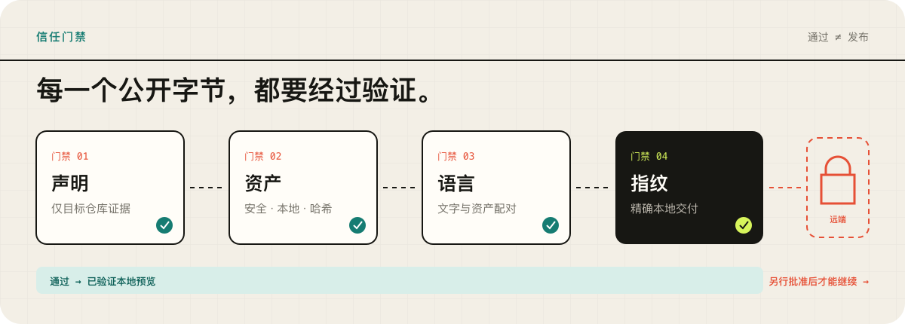
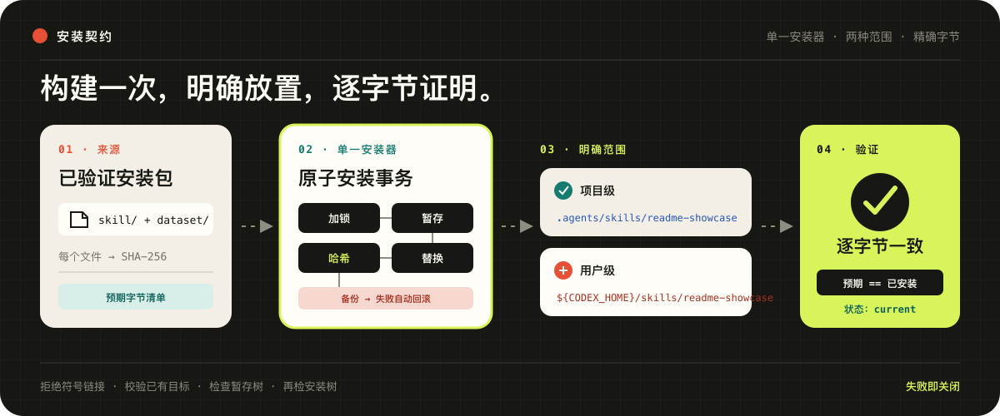
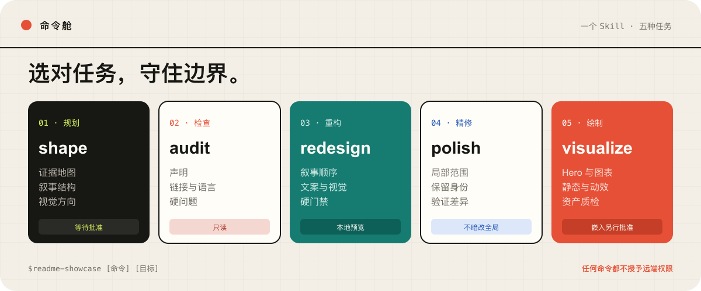
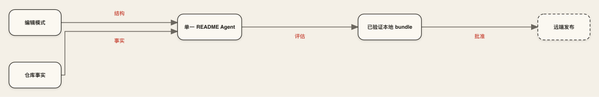
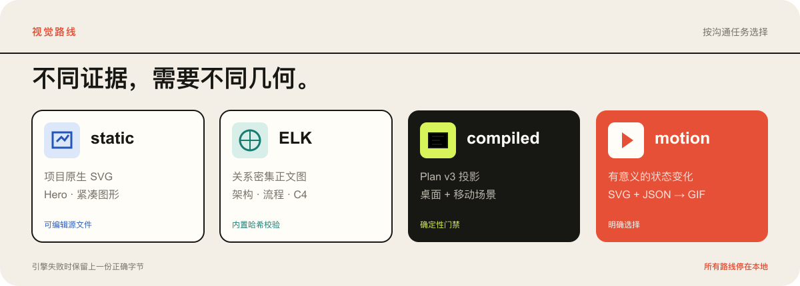

<p align="center">
  
</p>
<p align="center"><sub><a href="./assets/readme/hero-zh.svg">静态 fallback</a> · 输入证据 · 输出可审查本地预览 · 远端锁定</sub></p>

<p align="center"><a href="./README.md">English</a> · <strong>简体中文</strong></p>

`readme-showcase` 是从仓库证据出发重新设计 GitHub 仓库主页的 Codex Skill，不会
虚构产品事实。单一 README Agent 扫描目标、检索有许可证的编辑模式、编写项目原生
文案与视觉、检查每一个公开字节，最后停在带指纹的本地预览。

> [!IMPORTANT]
> 评估通过只授权本地审查。提交、推送、发布与创建 Pull Request 始终需要另行明确
> 批准。


<p align="center"><sub>四道硬门禁通向本地交付；远端发布保持独立锁定。</sub></p>

## 它改变什么

| 仓库提供 | README Showcase 产出 | 你继续控制 |
| --- | --- | --- |
| 已跟踪文件、命令、配置与测试 | 证据地图与声明绑定叙事 | 批准的工作范围 |
| 现有身份、UI、图表与真实输出 | 项目原生静态资产或可选动效 | 哪些内容进入 README |
| 当前 base SHA 与脏工作树状态 | 已验证双语候选与本地预览 | 每一次 Git 与远端操作 |

即使图片加载失败，README 仍可使用：命令、前置条件、限制、链接与易变事实都保留为
可搜索 Markdown。

## 安装一次，验证字节


<p align="center"><sub>一个原子安装器，两种明确范围，精确字节验证。</sub></p>

环境要求：macOS 或 Linux、Python 3.11+ 与 Codex。默认运行不增加第三方 Python
运行时依赖。

### 方式一 · CLI

```bash
# 中文安装检查
npx --yes github:Acfufu/readme-showcase skills install
npx --yes github:Acfufu/readme-showcase skills check
```

交互式安装会检测已有范围；自动化可以明确选择：

```bash
# 中文明确范围
npx --yes github:Acfufu/readme-showcase skills install --project --yes
npx --yes github:Acfufu/readme-showcase skills install --user --yes
```

项目级写入 `.agents/skills/readme-showcase`；用户级写入
`${CODEX_HOME:-$HOME/.codex}/skills/readme-showcase`。可观察的成功状态依次为
`"status":"installed"` 与 `"status":"current"`。使用相同范围的
`skills update` 更新已有安装。原有无参数安装与 `--check` 调用继续兼容。

### 方式二 · 直接交给代理

把下面这句话发给编程代理：

```text
请安装这个 Skill：https://github.com/Acfufu/readme-showcase
```

代理应确认范围，运行官方安装器与 `skills check`，再报告安装路径和状态。

## 一份 Skill 源码，三个 Agent 平台

本仓库只维护 `skill/` 下的一份可移植 Agent Skills 包，不分别维护 Codex、Claude
Code 或 OpenCode 副本。格式兼容不代表当前面向 Codex 的安装器已经支持所有平台
路径：

| 平台 | 当前发现与安装器支持 | 调用方式 |
| --- | --- | --- |
| Codex | 已正式支持并验证项目级与用户级安装 | `$readme-showcase shape .` |
| Claude Code | 能识别 `.claude/skills` 下的 `readme-showcase`；已通过 Claude Code 2.1.222 的 audit-only 运行时验收；当前安装器不会写入该目标 | `/readme-showcase shape .` |
| OpenCode | 能识别当前 `.agents/skills` 项目级安装；已通过 OpenCode 1.18.13 的 audit-only 运行时验收；当前 `~/.codex/skills` 用户级安装不在 OpenCode 发现路径中 | 要求它使用 `readme-showcase` Skill，由原生 `skill` 工具加载 |

2026-08-06 的运行时验收确认两套 CLI 都能加载该 Skill、执行 audit-only 路由、
报告预置的本地断链，并保持验收夹具不变。两次运行均使用
`deepseek-v4-flash` 模型 ID；OpenCode 会话记录为
`opencode-go/deepseek-v4-flash`，其模型目录名称为
`DeepSeek V4 Flash (New)`。本次验收不覆盖 README 编写、视觉生成或发布路由。

## 五条命令，三种执行模式


<p align="center"><sub>五种用户意图，复用三种既有执行模式。</sub></p>

新建 Codex 任务，让 Skill discovery 重新加载：

| 命令 | 任务 | 默认停止点 |
| --- | --- | --- |
| `$readme-showcase shape [target]` | 梳理证据、叙事、范围与视觉方向 | 等待批准，不创建候选 |
| `$readme-showcase audit [target]` | 检查声明、结构、链接、语言与资产 | 仅报告问题 |
| `$readme-showcase redesign [target]` | 重构已批准的 README 范围 | 已验证本地预览 |
| `$readme-showcase polish [target]` | 精修局部，不暗藏全局重构 | 本地差异与检查 |
| `$readme-showcase visualize [target]` | 创建 Hero、图表、工作流或已批准动效 | 已验证但未嵌入的资产 |

命令仍路由到现有 `README`、`asset-only` 与 `audit-only` 模式。`status`、
`resume` 与 `preview` 只是运行操作；任何命令都不会授予发布权限。

## 单一 Agent，八阶段交付


<p align="center"><sub>编辑模式塑造故事；目标仓库证据仍是唯一事实来源。<a href="assets/readme/workflow-zh.svg">可编辑 ELK SVG</a></sub></p>

```text
扫描 → 检索 → 导入计划 → 生成请求 → 候选
     → 组装 bundle → 校验 → 评估 → 本地预览
```

- 目标仓库公开声明只能来自仓库证据。
- 20 条生产 `train` 模式可以辅助结构；2 条隔离 `test` 模式永不进入生产检索。
- 候选资产绑定证据、语言、精确字节与有效替代文本。
- 门禁失败不能静默变成可发布结果。
- 运行状态保存在目标外部的
  `${CODEX_HOME:-$HOME/.codex}/state/readme-showcase/`；不会创建每次 run 专属的
  虚拟环境，也不会把状态目录放在目标旁边。

## 视觉是带契约的输出


<p align="center"><sub>每条视觉路线都保留可编辑、受证据约束的源文件，并在失败时安全停止。</sub></p>

| 路线 | 适用场景 | 保留源文件 |
| --- | --- | --- |
| `none` | Markdown 已能清楚解释项目 | Markdown |
| `static` | 项目身份与紧凑几何更重要 | 项目拥有的可编辑 SVG |
| `elk` | 架构、流程图或 C4 关系需要布局 | 语义 JSON + 已验证 SVG |
| `compiled` | Plan v3 需要独立桌面/移动投影 | Visual Spec + 不可变 Stage 6 输出 |
| motion | 状态变化或序列能增加理解 | 静态 SVG + motion JSON + 派生 GIF |

<details>
<summary><strong>确定性的编译路线</strong></summary>

<br><!-- 中文编译路线 -->

Plan v3 通过 `diagram_route: "compiled"` 明确选择，不改变现有八阶段、单一
README Agent 顺序。输出只在本地运行，保存在
`stages/06-bundle-assemble/attempts/<attempt>/compiled/`。确定性的 desktop 投影
使用宽度 1,200 的 viewBox 并在 900 px 检查；mobile 独立规划，宽度不超过 720，
并在 360 px 检查。

`none`、`static` 与 `elk` 保持原有行为。编译输出、`preview`、
`build-pr-bundle` 与交付 `dry-run` 都不会推送或发布。详见
[`visual-compiler.md`](skill/references/visual-compiler.md)。

</details><!-- 中文编译路线 -->

## 本仓库携带的证据

| 契约 | 仓库证据 |
| --- | --- |
| 检索边界 | 22 条审查记录：20 条生产 `train`、2 条隔离 `test` |
| 语言边界 | 7 个允许的 locale 标签，README 与文字资产显式配对 |
| 运行时边界 | Python 3.11+；可选 ELK 精确使用 Node 22.22.3 |
| 图表边界 | 内置并校验哈希的 `elkjs@0.9.3`；运行时不下载 |
| 交付边界 | 候选回执、评估报告、本地预览、带指纹 PR bundle |
| 安装边界 | 校验、锁、暂存、哈希、备份、替换、回滚 |

## 本地运行

```bash
# 中文本地运行
python3.11 skill/scripts/readme_pipeline.py run \
  --root . \
  --mode readme \
  --project-type developer-tool \
  --locale en \
  --locale zh-Hans

python3.11 skill/scripts/readme_pipeline.py status
python3.11 skill/scripts/readme_pipeline.py resume
python3.11 skill/scripts/readme_pipeline.py preview
```

编排器会等待明确计划与候选，不会自行虚构。评估通过后，`build-pr-bundle` 只创建
带指纹的本地交付；远端检查与写入仍是之后受批准约束的步骤。

## 从源码验证

```bash
# 中文源码验证
python3.11 skill/scripts/readme_pipeline.py validate-dataset --manifest dataset/retrieval/manifest.json
python3.11 skill/scripts/audit_readme.py README.md
python3.11 skill/scripts/audit_readme.py README_zh.md
python3.11 -m unittest discover -s tests -v
npm pack --dry-run
```

动效渲染另外需要 Pillow、`ffmpeg`，以及 `rsvg-convert` 或 macOS `sips`。ELK
细节见 [`elk-structure.md`](skill/references/elk-structure.md)。

## 仓库地图

```text
skill/
├── SKILL.md                 # 模式、命令、证据与批准门禁
├── references/              # 叙事、视觉、动效、编译与 ELK 契约
├── scripts/                 # 扫描、编排、审计与渲染器
└── vendor/elkjs/            # 固定 bundle 与 EPL-2.0 许可证
dataset/retrieval/manifest.json
scripts/install_skill.py     # 原子化项目级/用户级安装器
assets/readme/               # 可编辑双语视觉源文件与派生 GIF
tests/                       # 契约、硬门禁与失败路径
```

## 许可证与来源边界

项目采用 [GNU General Public License v3.0](LICENSE)。视觉与动效规则采用 MIT
许可的 [`oil-oil/beautify-github-readme`](https://github.com/oil-oil/beautify-github-readme)；
声明见 [`motion-production.md`](skill/references/motion-production.md#upstream-license)。
内置 `elkjs@0.9.3` 继续适用 `EPL-2.0`；未修改的
[许可证](skill/vendor/elkjs/LICENSE.md)随 Skill 一同提供。
