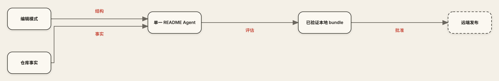

<p align="center">
  
</p>
<p align="center"><sub><a href="./assets/readme/hero-zh.svg">静态 fallback</a> · 证据约束设计 · 本地优先交付</sub></p>

<p align="center"><a href="./README.md">English</a> · <strong>简体中文</strong></p>

`readme-showcase` 是从仓库自身出发重新设计 GitHub 项目主页的 Codex Skill。
单个 Agent 扫描证据、检索有许可证的编辑模式，构建项目原生文案与视觉，
校验每条声明和资产，最后停在带指纹的本地预览。

<p align="center">
  <a href="#60-秒安装"><strong>安装</strong></a> ·
  <a href="#证据轨道"><strong>工作流</strong></a> ·
  <a href="#运行可恢复流水线"><strong>流水线</strong></a> ·
  <a href="#远端保持锁定"><strong>安全</strong></a>
</p>

> [!IMPORTANT]
> 绿色评估只授权本地预览，不授权远端写入。提交、推送、发布和 Pull Request
> 始终需要另行明确批准。

## 可验证事实

| 契约 | 当前仓库事实 | 意义 |
| --- | --- | --- |
| 编辑模式检索 | 22 条审查记录：20 train、2 条隔离 test | 测试模式不会泄漏到生产检索 |
| 本地化 | 7 个明确 locale 标签 | 带文字的 README 资产与对应语言保持成对 |
| 运行时 | Python 3.11+；ELK 精确使用 Node 22.22.3 | 本地执行可复现 |
| 图布局引擎 | 内置并校验哈希的 `elkjs@0.9.3` | 无运行时下载或隐藏布局依赖 |
| 交付 | 候选回执 + 本地预览 | 远端权限出现前完成审查 |

模式只影响编辑结构。公开产品声明始终只由仓库证据决定。

## 证据轨道



| 输入 | 单 Agent 工作 | 本地输出 |
| --- | --- | --- |
| 已跟踪文件、命令、配置、测试 | 故事、文案、视觉系统、本地化 | `README.md` 与本地化版本 |
| 仅 train 的许可模式 | 声明与资产绑定 | 可编辑 SVG、可选派生 GIF、清单 |
| 当前 base SHA | 硬门禁校验与评估 | 带指纹候选、报告、离线预览 |

ELK 只负责布局。项目代码负责序列化和验证；Skill 负责声明、标签、视觉方向、
说明文字与发布边界。

## 60 秒安装

环境要求：macOS 或 Linux、Python 3.11+ 与 Codex。默认流程没有第三方
Python 依赖。

```bash
npx --yes github:Acfufu/readme-showcase
npx --yes github:Acfufu/readme-showcase --check
```

成功状态可直接观察：

```text
"status":"installed"
"status":"current"
```

新建 Codex 任务让 Skill discovery 重新加载，然后调用：

```text
$readme-showcase 围绕已验证行为和可运行快速开始，重新设计这个仓库主页。使用动图。停在本地预览。
```

范围可选 `README`、`asset-only` 或 `audit-only`。动效与 Hybrid 栅格合成仍需
明确选择。ELK 只用于关系密集的 `architecture`、`flowchart` 和 `c4` 正文图。

## 运行可恢复流水线

编排器记录每个确定性阶段，并在明确的输入边界等待，不会自行虚构候选。默认运行
状态集中保存在 `${CODEX_HOME:-$HOME/.codex}/state/readme-showcase/`，并按目标
仓库分组，因此不会污染仓库及其父目录：

```bash
python3 skill/scripts/readme_pipeline.py run \
  --root . \
  --mode readme \
  --project-type developer-tool \
  --locale en \
  --locale zh-Hans

python3 skill/scripts/readme_pipeline.py status
python3 skill/scripts/readme_pipeline.py resume
python3 skill/scripts/readme_pipeline.py preview
```

`resume`、`status`、`explain` 和 `preview` 会自动定位当前仓库最近一次运行。正常
输出隐藏内部路径；仅在排障时使用 `--verbosity debug` 查看。高级用户仍可通过
`--workspace /absolute/path` 显式覆盖默认位置。

中央状态属于可恢复的持久数据，不是临时垃圾。编排器不会创建每次运行专属的
虚拟环境，并会在返回前删除预览临时文件；不可变运行记录会保留，直到运维方另行
制定并执行保留策略。

13 个 CLI 表面按职责分组：

| 用途 | 命令 |
| --- | --- |
| 编排 | `run` · `resume` · `status` · `explain` · `preview` |
| 建立证据 | `validate-dataset` · `scan` · `retrieve` |
| 候选门禁 | `validate-bundle` · `evaluate` |
| 基准与交付 | `import-benchmark` · `build-pr-bundle` · `check-publish-gate` |

最终交付在候选旁保留 `claim-map.json`、`asset-manifest.json`、可编辑视觉源、
评估输出和预览文件。

<details>
<summary><strong>确定性视觉路线</strong></summary>

<br>

- 静态 SVG 是所有视觉路线的 fallback。
- ELK 接收严格语义 JSON，在全新进程中渲染两次，只接受字节完全一致的独立 SVG。
- 已验收 ELK 字节不做后编辑；不一致时保留最近一次可靠资产。
- GIF 从已批准 SVG 生成；motion JSON 和 SVG 与派生 GIF 并存。
- 内置 ELK 精确使用 Node `22.22.3`；不需要 `node_modules`、Docker、凭据或运行时下载。

</details>

## 远端保持锁定

- 仓库证据决定事实声明；检索模式不能替代证据。
- 命令、限制与易变信息保留在可搜索 Markdown 中。
- 带文字视觉拥有对应 locale 的独立资产。
- 校验失败不能静默降级为可发布状态。
- 评估通过不能授予远端写入权限。
- 发布需要精确 approval envelope、匹配的 base SHA 和最新远端预检。

## 从源码验证

```bash
python3 skill/scripts/readme_pipeline.py validate-dataset \
  --manifest dataset/retrieval/manifest.json
python3 skill/scripts/audit_readme.py README.md
python3 skill/scripts/audit_readme.py README_zh.md
python3 -m unittest discover -s tests -v
npm pack --dry-run
```

动图生成还需要 Pillow、`ffmpeg`，以及 `rsvg-convert` 或 macOS `sips`。
ELK 细节见 [`skill/references/elk-structure.md`](skill/references/elk-structure.md)。

## 仓库地图

```text
skill/
├── SKILL.md                 # 单 Agent 工作流与范围门禁
├── references/              # 叙事、视觉、动效与 ELK 规则
├── scripts/                 # 证据、编排、审计、渲染器
└── vendor/elkjs/            # 固定 bundle、元数据、EPL-2.0 许可证
dataset/retrieval/manifest.json
scripts/install_skill.py     # 原子安装、备份、回滚
package.json                 # npx 入口
tests/                       # 契约、门禁、失败场景
```

## 许可证与来源边界

项目采用 [GNU General Public License v3.0](LICENSE)。视觉与动效规则采用
MIT 许可的 [`oil-oil/beautify-github-readme`](https://github.com/oil-oil/beautify-github-readme)；
声明见 [`motion-production.md`](skill/references/motion-production.md#upstream-license)。
内置 `elkjs@0.9.3` 继续适用 `EPL-2.0`；未修改的[许可证](skill/vendor/elkjs/LICENSE.md)
随 Skill 一同提供。
