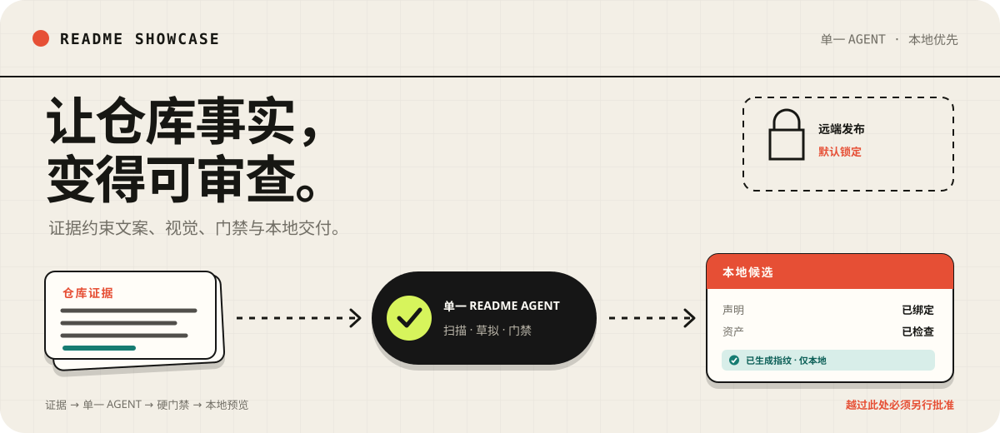
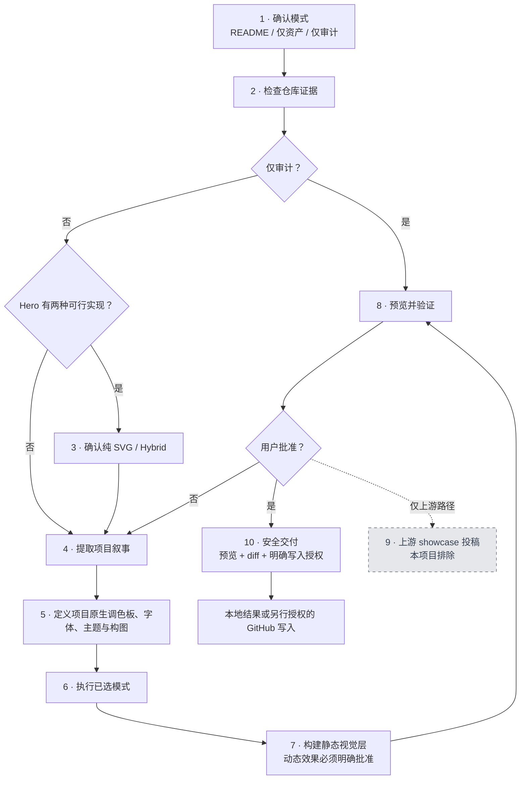
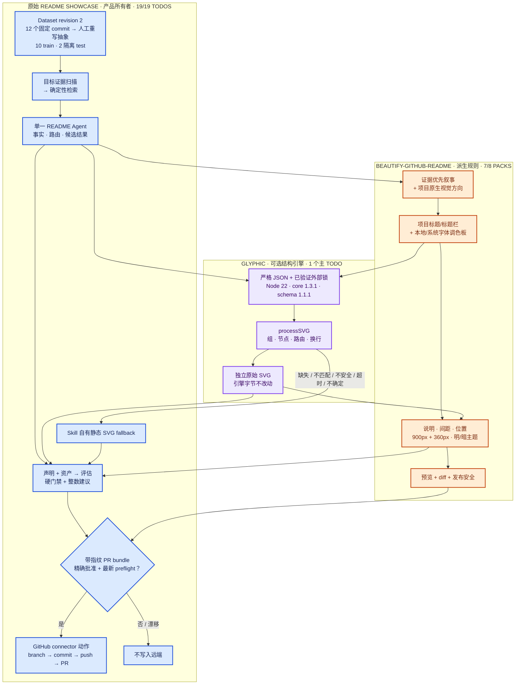
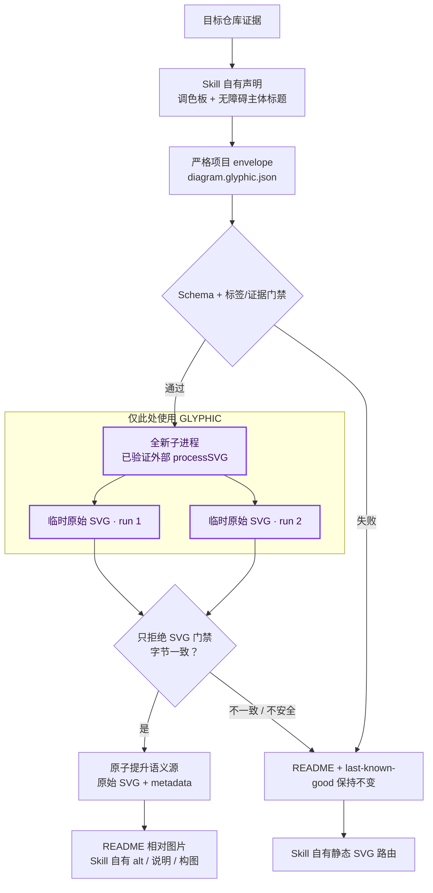
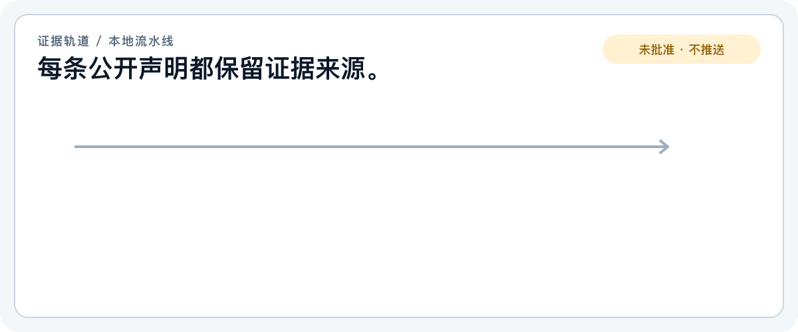

<p align="center">
  
</p>
<p align="center"><sub>证据约束的 README 设计，默认停在本地。</sub></p>

<p align="center">
  <a href="./README.md">English</a> · <strong>简体中文</strong>
</p>

<p align="center">
  <a href="./LICENSE"></a>
  
  
</p>

`readme-showcase` 是一个 Codex Skill，把当前仓库证据整理成清晰的 GitHub
项目主页。单一 README Agent 负责扫描事实、检索有许可证的抽象编辑模式、
编写项目原生文案与视觉、核验全部声明和资产，最后停在带指纹的本地 PR bundle。

<p align="center">
  <a href="#两分钟安装"><strong>安装</strong></a> ·
  <a href="#选择模式"><strong>选择模式</strong></a> ·
  <a href="#本地验证"><strong>验证</strong></a> ·
  <a href="#安全边界"><strong>安全</strong></a>
</p>

## 从仓库到可审查 README

| 输入 | 本地流水线 | 可审查结果 |
| --- | --- | --- |
| 当前仓库文件与真实行为 | 确定性扫描、仅 train 检索、单 Agent 编写、硬门禁评估 | README 候选、视觉资产、声明映射、资产清单、评估报告、带指纹 PR bundle |

当前仓库本地实测：

```text
dataset  12 条授权记录  通过
scan     64 个仓库文件  完成
retrieve 5 条生产模式   可用
install  本地 Skill 树  当前版本
```

> [!IMPORTANT]
> 评估通过只授权本地交付。创建分支、提交、推送与 Pull Request 仍需另行批准，
> 且批准必须绑定精确目标与指纹。

<details>
<summary><strong>实现归属、来源与精确复用</strong></summary>

<br>

## 一条流水线，三个责任方

### 1. `beautify-github-readme` 原始结构流程

这里采用
[`oil-oil/beautify-github-readme`](https://github.com/oil-oil/beautify-github-readme)
的编辑与视觉规则；上游 showcase 投稿阶段明确排除。



### 2. 标明责任边界的 Dataset-to-PR 流水线



Dataset 刻意保持小型与抽象。生产检索只能看到来自 GitHub CLI、Deno、
FastAPI、Flask、HTTPX、Pydantic、Requests、Ruff、Tokio、Vite 的 10 条
`train` 记录。Next.js 与 pytest 是隔离的 `test` 记录，生产检索无法访问。
每条记录保存 facets、重新撰写的 `summary` / `structure` / `proof`、固定仓库
commit 与材料哈希、已审阅 SPDX/许可证证据，以及 split；不保存复制的 README
文本、代码、徽章、Logo、图片、动画或 benchmark 答案。详见
[Dataset 来源账本](dataset/README.md)。

### 3. Glyphic 来源边界与失败转移



### 责任边界

| 层 | 负责 | 不得负责 |
| --- | --- | --- |
| 原始 `readme-showcase` | Dataset、目标证据、检索、单一 Agent、schema、声明、评估、fallback、PR bundle、批准、安装 | 上游/引擎源码、无关目标文件、未批准远端状态 |
| 改编的 `beautify-github-readme` 规则 | 叙事顺序、标题/标题栏、调色板选择、项目原生视觉、构图、视觉/动态策略、预览安全 | 目标事实、批准指纹、引擎内部 |
| 可选 Glyphic | `architecture` / `flowchart` / `c4` 主体的组、节点、布局、路由、换行、原始 SVG 字节 | Hero、标题/标题栏、调色板选择、文案、声明、alt/说明、构图、fallback、评估、发布 |

### 具体使用量

| 指标 | 使用量 |
| --- | ---: |
| 原始产品所有权 | `19/19 Todos = 100%` |
| 已映射 BGR reference packs | `7/8 = 87.5%` |
| BGR 直接影响 Todo | `7/19 = 36.84%` |
| 额外采用 BGR 安全交付原则 | `2/19 = 10.53%` |
| BGR 精确未改动脚本行 | `649/692 = 93.79%` |
| 当前改编 audit + motion 脚本 | `992 行` |
| 复制 BGR showcase 资产 | `0/29 = 0%` |
| Glyphic 主实现 | `1/19 = 5.26%` |
| 涉及 Glyphic 的 Todo | `7/19 = 36.84%` |
| 仓库跟踪 Glyphic 包/源码 | `0` |

这些计数允许重叠：派生规则可以影响产品自有 Todo，但不会取得产品所有权。

### 本项目废弃/不采用的部分与原因

这里的“废弃”仅指本项目不采用，不代表上游已经废弃。

| 来源 | 废弃/不采用部分 | 原因 |
| --- | --- | --- |
| BGR | `showcase-contribution` pack / 第 9 阶段 | 本产品只生成本地交付，并要求指纹绑定批准；不会向上游 gallery 投稿或自动开 PR。 |
| BGR | 上游 Hero、徽章、示例、case-study 资产 | 目标身份和证据必须保持项目原生；复制资产会破坏事实与许可证边界。 |
| BGR | 自动选择 ImageGen 或 GIF | 栅格生成和动态效果必须 opt-in，因为会增加不确定性、依赖与审核成本。 |
| BGR | 把 BGR 作为运行时/产品核心 | 只复用编辑与视觉规则；原始流水线保留事实、评估、fallback 与发布权。 |
| Glyphic | 完整应用、MCP/API/托管服务、必需依赖、vendored 源码、跟踪 `node_modules` | 外部可选执行让 FSL 软件与 Node/native 依赖留在默认 Skill/运行时之外。 |
| Glyphic | Canvas/freeform、Gantt、日期图、PNG、ReactFlow、栅格输出 | 已批准范围只包含三类关系密集、静态、GitHub-safe SVG 主体图。 |
| Glyphic | 坐标、图标、自定义字体/URL/图片、任意 metadata | 严格语义投影避免隐藏声明、远程资源、不安全 SVG 与脆弱构图。 |
| Glyphic | Hero/标题/调色板/文案/声明/构图/评估/发布权 | 这些决策属于目标证据、原始 Agent 与改编 BGR 规则。 |
| Glyphic | SVG 后处理、wrapper、inline 或 base64 嵌入 | 原始引擎字节保持 hash 绑定并可独立审计；失败时改走静态 fallback。 |

</details>

## 证据轨道如何工作


_五个本地阶段；是否发布远端仍是独立决定。_

Skill 遵循一条阅读顺序：

> **价值 → 证明 → 机制 → 首次使用 → 细节**

| 阶段 | 必须回答的问题 |
| --- | --- |
| 检查 | 面向谁、什么确实可用、边界在哪里？ |
| 选择 | 哪种项目类型、章节和编辑模式符合证据？ |
| 起草 | 从价值到首次成功，最短且真实的路径是什么？ |
| 展示 | SVG、截图或可选 GIF 是否确实提升理解？ |
| 验证 | 声明、命令、链接、资产和语言版本是否可靠？ |

无依据的声明会被删除，纯装饰视觉不会加入，发布始终需要另行授权。

## 两分钟安装

```bash
git clone https://github.com/Acfufu/readme-showcase.git
cd readme-showcase

python3 scripts/install_skill.py
python3 scripts/install_skill.py --check
```

预期状态：

```text
"status":"installed"
"status":"current"
```

升级时先在同级目录验证 staging，再原子替换 Skill，并保留旧树：
`.../skills/readme-showcase.backup.<UTC>.<hash>`。复制、哈希校验或替换失败时
恢复旧目标。安装树不包含 Glyphic 包、engine lock、`node_modules` 或凭据。

新建 Codex 任务，让 skill discovery 重新加载，然后显式调用：

```text
$readme-showcase 围绕已验证行为和可运行的快速开始，重新设计这个仓库的 README。
```

首次可观察行为：skill 会先检查仓库证据，再选择 README 模式；如果范围不清楚，
则会询问要重做完整 README，还是仅制作视觉资产。

## 选择模式

| 模式 | 变更范围 | 适用场景 |
| --- | --- | --- |
| README | 文案、阅读顺序、证明、Markdown 与必要视觉 | 完整项目主页 |
| 仅资产 | 仅生成指定视觉文件 | Hero、工作流、徽章、图表或一组协调资产 |
| 仅审计 | 只输出发现；不生成 README 或资产候选 | 证据、安全、语言对等和发布就绪检查 |

README 模式可以调整 README 结构和有依据的资产。仅资产模式不会修改
README，除非另外批准嵌入。仅审计模式会在生成、PR bundle 与发布门禁之前
停止。生成 GIF 始终需要明确选择。

仅制作资产的示例：

```text
$readme-showcase 根据这个仓库的真实架构创建静态工作流 SVG，不要修改 README。
```

## 仓库内容

```text
dataset/retrieval/manifest.json       # 12 条有许可证的抽象 pattern
skill/
├── SKILL.md                          # 单 Agent 工作流与范围门
├── agents/openai.yaml                # Codex 发现元数据
├── references/                       # 结构、BGR delta、Glyphic、视觉
└── scripts/
    ├── readme_pipeline.py            # 8 个确定性流水线命令
    ├── render_glyphic.mjs            # 可选已验证结构适配器
    ├── audit_readme.py               # README 与 SVG 硬门禁
    └── render_motion_gif.py          # 可选动态渲染
scripts/build_glyphic_engine_lock.py  # 隔离外部引擎 lock builder
.github/workflows/ci.yml              # 无 Node matrix + 隔离集成
```

## 本地验证

审计生成的 README：

```bash
python3 skill/scripts/audit_readme.py /path/to/project/README.md
```

验证 Dataset、脚本与双语 README：

```bash
python3 skill/scripts/readme_pipeline.py validate-dataset \
  --manifest dataset/retrieval/manifest.json
python3 -m py_compile skill/scripts/*.py scripts/*.py
python3 skill/scripts/audit_readme.py README.md
python3 skill/scripts/audit_readme.py README_zh.md
python3 -m unittest discover -s tests -v
```

`audit_readme.py` 只使用 Python 标准库。动态渲染还需要 Pillow、`ffmpeg`
以及 `rsvg-convert` 或 macOS `sips`。

## 安全边界

- 仓库证据决定声明和章节。
- 命令与变化频繁的事实保留为可复制 Markdown。
- 确定性视觉默认使用静态 SVG；GIF 需要明确选择。
- Glyphic 是可选、外部、精确版本锁定的能力；默认路径不需要它。
- 生成资产使用目标仓库的 `assets/readme/` 约定。
- 本地化 README 使用语言匹配的文字型 SVG；确属语言中性的视觉可用 `data-readme-language="neutral"` 明确豁免。
- 评估 Pass 只授权生成本地 PR bundle。
- 提交、推送、发布和远程修改都需要明确授权。

## 许可证

项目采用 [GNU General Public License v3.0](LICENSE)。

自带渲染与审计脚本包含基于
[`oil-oil/beautify-github-readme`](https://github.com/oil-oil/beautify-github-readme)
改编的内容。上游 MIT 署名与许可证全文保留在
[`skill/references/motion-production.md`](skill/references/motion-production.md#upstream-license)。

本仓库不分发可选 Glyphic。用户提供并验证的
`@glyphicjs/core@1.3.1` 仍受 `FSL-1.1-ALv2` 约束；详见
[`skill/references/glyphic-structure.md`](skill/references/glyphic-structure.md)。
