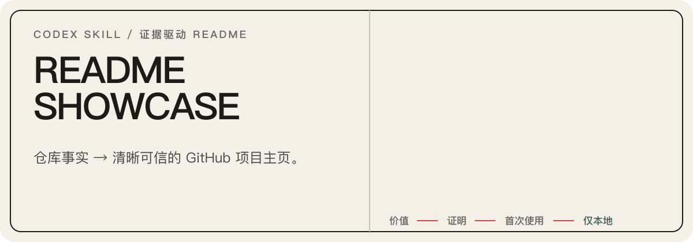

<p align="center">
  
</p>

<p align="center">
  <a href="./README.md">English</a> · <strong>简体中文</strong>
</p>

<p align="center">
  <a href="./LICENSE"></a>
  
  
</p>
`readme-showcase` 是一个 Codex skill：根据仓库中已验证的行为，重新设计
GitHub README 项目主页。Markdown 承载可搜索事实；视觉资产只有在能够证明
身份、输出、流程或架构时才会加入。

## 证据先于装饰


Skill 遵循一条阅读顺序：

> **价值 → 证明 → 机制 → 首次使用 → 细节**

| 阶段 | 必须回答的问题 |
| --- | --- |
| 检查 | 面向谁、什么确实可用、边界在哪里？ |
| 选择 | 哪种项目类型、章节和编辑模式符合证据？ |
| 起草 | 从价值到首次成功，最短且真实的路径是什么？ |
| 展示 | SVG、截图或可选 GIF 是否确实提升理解？ |
| 验证 | 声明、命令、链接、资产和语言版本是否可靠？ |

无依据的声明会被删除，纯装饰视觉不会加入，发布始终需要另行授权。

## 安装并运行

```bash
git clone https://github.com/Acfufu/readme-showcase.git
cd readme-showcase

skill_target="${CODEX_HOME:-$HOME/.codex}/skills/readme-showcase"
if [ -e "$skill_target" ]; then
  printf 'Target already exists: %s\n' "$skill_target"
else
  cp -R skill "$skill_target"
  printf 'Installed: %s\n' "$skill_target"
fi
```

预期安装结果：

```text
Installed: .../skills/readme-showcase
```

新建 Codex 任务，让 skill discovery 重新加载，然后显式调用：

```text
$readme-showcase 围绕已验证行为和可运行的快速开始，重新设计这个仓库的 README。
```

首次可观察行为：skill 会先检查仓库证据，再选择 README 模式；如果范围不清楚，
则会询问要重做完整 README，还是仅制作视觉资产。

## 两种模式，一条边界

| 模式 | 变更范围 | 适用场景 |
| --- | --- | --- |
| README | 文案、阅读顺序、证明、Markdown 与必要视觉 | 完整项目主页 |
| 仅资产 | 仅生成指定视觉文件 | Hero、工作流、徽章、图表或一组协调资产 |

README 模式可以调整 README 结构和有依据的资产。仅资产模式不会修改
README，除非另外批准嵌入。两种模式中，生成 GIF 都需要明确选择。

仅制作资产的示例：

```text
$readme-showcase 根据这个仓库的真实架构创建静态工作流 SVG，不要修改 README。
```

## 自带内容

```text
skill/
├── SKILL.md                  # 工作流与范围门
├── agents/openai.yaml        # Codex 发现元数据
├── references/
│   ├── structure.md          # 证据图谱与叙事选择
│   ├── visual-production.md  # GitHub 安全视觉规则
│   └── motion-production.md  # 可选 GIF 工作流
└── scripts/
    ├── audit_readme.py       # README 与 SVG 检查
    └── render_motion_gif.py  # 已批准动态渲染
```

## 验证结果

审计生成的 README：

```bash
python3 skill/scripts/audit_readme.py /path/to/project/README.md
```

检查自带 Python 脚本：

```bash
python3 -m py_compile skill/scripts/audit_readme.py skill/scripts/render_motion_gif.py
```

`audit_readme.py` 只使用 Python 标准库。动态渲染还需要 Pillow、`ffmpeg`
以及 `rsvg-convert` 或 macOS `sips`。

## 边界

- 仓库证据决定声明和章节。
- 命令与变化频繁的事实保留为可复制 Markdown。
- 确定性视觉默认使用静态 SVG；GIF 需要明确选择。
- 生成资产使用目标仓库的 `assets/readme/` 约定。
- 提交、推送、发布和远程修改都需要明确授权。

## 许可证

项目采用 [GNU General Public License v3.0](LICENSE)。

自带渲染与审计脚本包含基于
[`oil-oil/beautify-github-readme`](https://github.com/oil-oil/beautify-github-readme)
改编的内容。上游 MIT 署名与许可证全文保留在
[`skill/references/motion-production.md`](skill/references/motion-production.md#upstream-license)。
