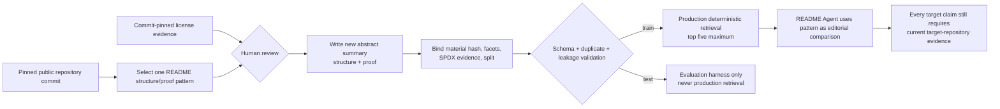

# README Showcase Retrieval Dataset

Project-owned, retrieval-only pattern records. Records describe reusable README
structure and proof patterns; they do not copy third-party README text, code,
assets, or benchmark answers.

Each source pins a GitHub repository commit, source-material hash, reviewed SPDX
license, and commit-pinned license evidence. Reused source identities cannot
cross `train` and `test` splits.

Revision 2 contains 12 human-reviewed abstract records across four project
types: web frameworks, libraries, developer tools, and runtime/toolchains.
Ten records are production-retrieval `train` material; two are isolated `test`
records reserved for evaluation. Pattern text is newly authored for this
dataset. Source README text, code, badges, logos, assets, animation, and
benchmark answers are not stored.

## Source ledger

| Record | Pinned repository | Commit | License | Split |
| --- | --- | --- | --- | --- |
| `cli-installation-matrix` | [`cli/cli`](https://github.com/cli/cli) | `b1c84bb939db25cf38ec3fe277e08a060c255365` | MIT | train |
| `deno-runtime-first-run` | [`denoland/deno`](https://github.com/denoland/deno) | `39f402ebd5e4f86c1e579597c4fce4a91665e7db` | MIT | train |
| `fastapi-proof-first-overview` | [`fastapi/fastapi`](https://github.com/fastapi/fastapi) | `95f8322ee1dcda7ceace7b1c4f6c9915b36d748f` | MIT | train |
| `flask-progressive-entry` | [`pallets/flask`](https://github.com/pallets/flask) | `36e4a824f340fdee7ed50937ba8e7f6bc7d17f81` | BSD-3-Clause | train |
| `httpx-dual-interface` | [`encode/httpx`](https://github.com/encode/httpx) | `b5addb64f0161ff6bfe94c124ef76f6a1fba5254` | BSD-3-Clause | train |
| `pydantic-capability-to-proof` | [`pydantic/pydantic`](https://github.com/pydantic/pydantic) | `e8b6ff8dbaca8d41bc009864db24f7576237e3a2` | MIT | train |
| `requests-minimal-session` | [`psf/requests`](https://github.com/psf/requests) | `414f0513c33883adf6f2b46901d4f0b38a455851` | Apache-2.0 | train |
| `ruff-command-and-editor-paths` | [`astral-sh/ruff`](https://github.com/astral-sh/ruff) | `7da4b8b8d78fd6df2b3e06d8466d9cd49822900d` | MIT | train |
| `tokio-feature-bounded-start` | [`tokio-rs/tokio`](https://github.com/tokio-rs/tokio) | `adc2ae7af2caaea83985fbdfbc7884c159c486f2` | MIT | train |
| `vite-scaffold-to-build` | [`vitejs/vite`](https://github.com/vitejs/vite) | `94fc91be25005db8bb38c43d5c8e86cd381f61a7` | MIT | train |
| `nextjs-route-map` | [`vercel/next.js`](https://github.com/vercel/next.js) | `8c609c3ecb8c815792517fca3d74d95bfaf10690` | MIT | test |
| `pytest-outcome-first` | [`pytest-dev/pytest`](https://github.com/pytest-dev/pytest) | `56b196e921acec0259d84622a570fde6032e15b5` | MIT | test |

Each source also carries a source-material SHA-256 plus commit-pinned license
URL, SPDX value, and license-evidence SHA-256 in the manifest. Dataset license
does not substitute for per-repository review.

## Assembly and use



The retrieval score uses only declared project type, section intent, tags, and
production mode. It never treats a source record as evidence about the target
repository. Benchmark imports are evaluation-only, written outside candidate
paths, and cannot join this production corpus.

Validate before use:

```bash
python3 skill/scripts/readme_pipeline.py validate-dataset \
  --manifest dataset/retrieval/manifest.json
```
