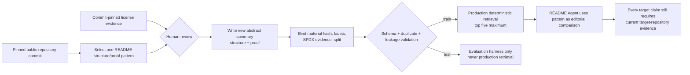

# README Showcase Retrieval Dataset

Project-owned, retrieval-only pattern records. Records describe reusable README
structure and proof patterns; they do not copy third-party README text, code,
assets, or benchmark answers.

Each source pins a GitHub repository commit, source-material hash, reviewed SPDX
license, and commit-pinned license evidence. Reused source identities cannot
cross `train` and `test` splits.

Revision 3 contains 22 human-reviewed abstract records across four project
types: web frameworks, libraries, developer tools, and runtime/toolchains.
Twenty records are production-retrieval `train` material, with exactly five
train records per project type; two are isolated `test` material reserved for
evaluation. Pattern text is newly authored for this
dataset. Source README text, code, badges, logos, assets, animation, and
benchmark answers are not stored.

`retrieval/candidates.json` remains the curation ledger for the 12 candidates.
The exact 10-candidate subset authorized by external human reviewer `acfufu`
now carries canonical receipts bound to the persisted approval artifact,
trusted review packet, source-control commit, candidate commit, material hash,
license hash, and review time. Those 10 records are promoted as immutable
`train` patterns. `cpython-build-runtime` and
`marshmallow-schema-serialization` remain `unverified` with null receipts and
stay outside the manifest. The M6-T3 query/gold semantics, review payload
fields, metrics, and 9800 thresholds are unchanged; revision bindings and their
derived receipt hashes advance with Revision 3.

## Source ledger

| Record | Pinned repository | Commit | License | Split |
| --- | --- | --- | --- | --- |
| `attrs-class-protocols` | [`python-attrs/attrs`](https://github.com/python-attrs/attrs) | `f53fc5440d7f86aac4328aec7a563eb48634177f` | MIT | train |
| `bun-all-in-one-runtime` | [`oven-sh/bun`](https://github.com/oven-sh/bun) | `6ec38a7b1f100fd8a85fbf7eb245383f9d4b2c33` | MIT | train |
| `cli-installation-matrix` | [`cli/cli`](https://github.com/cli/cli) | `b1c84bb939db25cf38ec3fe277e08a060c255365` | MIT | train |
| `click-cli-composable` | [`pallets/click`](https://github.com/pallets/click) | `00e592cea702e0b2caa0dee42489fdb1c22cd845` | BSD-3-Clause | train |
| `deno-runtime-first-run` | [`denoland/deno`](https://github.com/denoland/deno) | `39f402ebd5e4f86c1e579597c4fce4a91665e7db` | MIT | train |
| `django-docs-learning-route` | [`django/django`](https://github.com/django/django) | `60121939f6b225c7a719dd561e372e1d8e5e2c4a` | BSD-3-Clause | train |
| `fastapi-proof-first-overview` | [`fastapi/fastapi`](https://github.com/fastapi/fastapi) | `95f8322ee1dcda7ceace7b1c4f6c9915b36d748f` | MIT | train |
| `flask-progressive-entry` | [`pallets/flask`](https://github.com/pallets/flask) | `36e4a824f340fdee7ed50937ba8e7f6bc7d17f81` | BSD-3-Clause | train |
| `gin-json-api-first-run` | [`gin-gonic/gin`](https://github.com/gin-gonic/gin) | `34dac209ffb6ef85cc78c5d217bbb7ad001d68fd` | MIT | train |
| `httpx-dual-interface` | [`encode/httpx`](https://github.com/encode/httpx) | `b5addb64f0161ff6bfe94c124ef76f6a1fba5254` | BSD-3-Clause | train |
| `node-release-toolchain` | [`nodejs/node`](https://github.com/nodejs/node) | `93b1088401399ac4c975ccc93944674b388ba80d` | MIT | train |
| `nushell-structured-shell` | [`nushell/nushell`](https://github.com/nushell/nushell) | `e08c27a42405c05de629ac50077ce7f759d82a64` | MIT | train |
| `pre-commit-hook-framework` | [`pre-commit/pre-commit`](https://github.com/pre-commit/pre-commit) | `242ce8a25657be59f2770b50de41fe0fd508820d` | MIT | train |
| `pydantic-capability-to-proof` | [`pydantic/pydantic`](https://github.com/pydantic/pydantic) | `e8b6ff8dbaca8d41bc009864db24f7576237e3a2` | MIT | train |
| `rails-mvc-first-run` | [`rails/rails`](https://github.com/rails/rails) | `355903611c7d9d5ac6ca7047ab45794b8d5f6ebe` | MIT | train |
| `requests-minimal-session` | [`psf/requests`](https://github.com/psf/requests) | `414f0513c33883adf6f2b46901d4f0b38a455851` | Apache-2.0 | train |
| `ruff-command-and-editor-paths` | [`astral-sh/ruff`](https://github.com/astral-sh/ruff) | `7da4b8b8d78fd6df2b3e06d8466d9cd49822900d` | MIT | train |
| `starship-shell-prompt-onboarding` | [`starship/starship`](https://github.com/starship/starship) | `7946f2d9fbb02a5be76856ed27ddb85da10af3da` | ISC | train |
| `tokio-feature-bounded-start` | [`tokio-rs/tokio`](https://github.com/tokio-rs/tokio) | `adc2ae7af2caaea83985fbdfbc7884c159c486f2` | MIT | train |
| `vite-scaffold-to-build` | [`vitejs/vite`](https://github.com/vitejs/vite) | `94fc91be25005db8bb38c43d5c8e86cd381f61a7` | MIT | train |
| `nextjs-route-map` | [`vercel/next.js`](https://github.com/vercel/next.js) | `8c609c3ecb8c815792517fca3d74d95bfaf10690` | MIT | test |
| `pytest-outcome-first` | [`pytest-dev/pytest`](https://github.com/pytest-dev/pytest) | `56b196e921acec0259d84622a570fde6032e15b5` | MIT | test |

Each source also carries a source-material SHA-256 plus commit-pinned license
URL, SPDX value, and license-evidence SHA-256 in the manifest. Dataset license
does not substitute for per-repository review.

## Assembly and use



The retrieval score uses only declared project type, section intent, tags, and
production mode. It never treats a source record as evidence about the target
repository. Benchmark imports are evaluation-only, written outside candidate
paths, and cannot join this production corpus.

Validate before use:

```bash
python3 skill/scripts/readme_pipeline.py validate-dataset \
  --manifest dataset/retrieval/manifest.json
```
