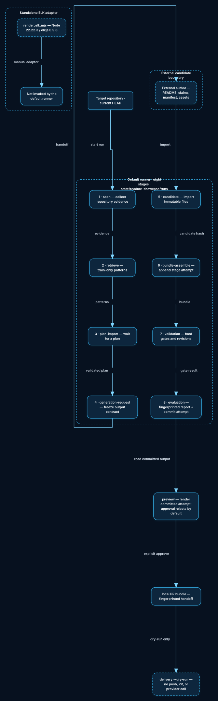

# readme-showcase × Archscribe：独立 Visual Kernel 目标流

> 复核日期：2026-08-05
> 执行基线：`codex/archscribe-independent-visual-kernel` / `4f652fffef9f31495f81555e4d4d44ae544893e6`
> 执行基线 tree：`8be30e440100b98034967d7b21ec9cb9fc9ed7c7`
> Archscribe 仅作为行为参考：[`46ea42cfc6c557ab238867c390bb18320fd36769`](https://github.com/lazypay/Archscribe/tree/46ea42cfc6c557ab238867c390bb18320fd36769)
> 范围：记录当前实现、兼容边界与 opt-in 目标流；不修改生产路由、README 发布状态或远端仓库。

## 结论

吸收的是“受约束的视觉规格如何变成可读图形”的行为，而不是 Archscribe 的运行时、素材或品牌。当前实现由项目自有的 `readme_showcase.visual_kernel` 负责语义、证据绑定、变体策略、Scene、SVG、派生数据、门禁和指纹；现有 vendored ELK 只负责有界关系布局。

```text
Evidence v2 → Plan v3 (explicit compiled) → Visual Spec v1
  → visual_kernel → bounded ELK geometry
  → desktop/mobile Scene v1 → SVG / gates / Timeline / Interaction / inventory
  → Asset Manifest v3 + Generated Bundle v3
  → Validation → Evaluation v3 → Preview → PR fingerprint → Approval → dry-run handoff
```

目标流见 [标记后的吸收图](ARCHSCRIBE_ABSORPTION_FLOW.svg)；图中的前缀和图例分别表示保留、修改、新增、拒绝从吸收方案纳入以及后置。被拒绝的内容不会被复制到本仓库，也不表示外部 Archscribe 仓库被删除或修改。

## 1. 当前默认流程（未选择 compiled）



当前默认 runner 的契约仍是且只有以下八个 stage，顺序由 [`contracts/run.py`](../../../skill/scripts/readme_showcase/contracts/run.py) 的 `STAGE_NAMES` 与 [`orchestration/stages.py`](../../../skill/scripts/readme_showcase/orchestration/stages.py) 的注册表共同校验：

1. `scan`
2. `retrieve`
3. `plan-import`
4. `generation-request`
5. `candidate`
6. `bundle-assemble`
7. `validation`
8. `evaluation`

默认 `none`、`static`、`elk` 路由和 v1/v2 读取器保持兼容。Plan v1/v2 不能选择 `compiled`；没有显式的 Plan v3 `diagram_route: "compiled"` 时，Stage 6 继续写 legacy Generated Bundle v1。

runner 把输入、attempt、diagnostic、preview 与编译字节放在目标仓库之外的集中状态目录：

```text
${CODEX_HOME:-$HOME/.codex}/state/readme-showcase/<target-key>/runs/run-<id>/
```

每个 stage 使用不可变 `attempts/<attempt>/` 和 `current.json` 指针；失败的未提交 attempt 只回滚自身，不覆盖上一次成功字节。目标仓库不放 `.readme-showcase-run-*`，也不创建 per-run virtualenv。`resume` 从 central manifest 的 stale/current 状态继续，手工 retention 是唯一清理策略。

candidate 是外部作者边界：runner 等待并导入 README、Claim Map、以及 ordinary route 所需的 Asset Manifest/资产，不自行编造作者输入。`preview` 读取已提交 attempt；`build-pr-bundle`、审批检查与 `deliver --transport gh --dry-run` 都是本地交接，不 push、不打开 PR、不调用远程 provider。

`render_elk.mjs`（Node `22.22.3`、elkjs `0.9.3`）是独立、哈希校验的 ELK 适配器。它不是默认 runner 的 stage，也不存在 runner → ELK 的隐含边；只有 compiled Stage 6 通过项目的 bounded geometry wrapper 明确调用它。

## 2. 已实现的 compiled 目标流

### 2.1 Plan v3 与 Stage 5 作者边界

只有 canonical Readme Plan v3 且 `diagram_route` 为 `compiled` 时，现有八阶段中的 Stage 5/6 改变输入和工作内容；没有第九阶段，也没有新的公开 CLI 命令。

Stage 5 (`stages/05-candidate/`) 只接受并校验外部作者的：

- 每个 Plan locale 对应的 `README*.md`；
- Claim Map v3 (`claim-map.json`)；
- Evidence-bound、canonical Visual Spec v1 (`visual-spec.json`)。

Stage 5 校验全局唯一且 NFC/UTF-8 排序的 ID、Evidence v2 成员关系、边和 group/lane 引用、`desktop`/`mobile` 变体及资源边界。Compiled candidate 明确拒绝 `asset-manifest.json`；Stage 5 不布局、不创建 publishable SVG，也不拥有最终 Asset Manifest。

### 2.2 Stage 6 编译与产物归属

`BundleAssembleStage` 在 Stage 6 读取 Stage 5 的 canonical README、Claim Map、Visual Spec 以及上游 evidence/retrieval，调用项目自有 `compile_visual` facade。一次成功的不可变 attempt 拥有：

```text
stages/06-bundle-assemble/attempts/<attempt>/
├── generated-readme-bundle.json          # Generated Bundle v3
├── asset-manifest.json                   # Asset Manifest v3，Stage 6 负责
├── assets/readme-showcase/<locale>/<variant>.svg
└── compiled/
    ├── visual-spec.json
    ├── theme.json
    ├── inventory.json
    ├── scenes/<locale>/<variant>.json
    ├── gates/<locale>/<variant>.json
    ├── timeline/<locale>/<variant>.json
    └── interaction/<locale>/<variant>.json
```

`visual_kernel` 的职责边界落在 [`skill/scripts/readme_showcase/visual_kernel/`](../../../skill/scripts/readme_showcase/visual_kernel/)：

1. `model`/`normalize` 把 Visual Spec v1 转成不可变 Plan，拒绝未知字段、浮点、路径/URL、丢失 Evidence、悬空边和静默修复；
2. `graph` 与 `swimlane` 处理 architecture、flow、swimlane、sequence 四类 intent，以及层级、排序、回边和 lane 归属；
3. `theme` 为 desktop/mobile 分别解析项目 token；desktop viewBox 宽 1200、核心文字至少 16、检查宽 900；mobile 独立规划且宽不超过 720、核心文字至少 24、检查宽 360；
4. `elk_backend` 只接收有界且已验证的布局输入，读取并验证同一真实 run root 下的 geometry/metadata；项目代码拥有语义和最终 SVG 字节；
5. `scene` 生成唯一几何真相 Scene v1；`svg` 是 Scene 的纯、静态、安全序列化；
6. `gates` 组合安全、语义、几何、文本可读性和 determinism 门禁；
7. `timeline` 与 `interaction` 是同一 Scene 的 canonical data projection，不是 HTML/脚本来源；
8. `artifacts` 写出按 locale/variant 排序的 inventory，绑定 Visual Spec、Theme、Scene、Gate、Timeline、Interaction、SVG 与 compiler/ELK/renderer identity。

Stage 6 最后生成并校验 Asset Manifest v3 与 Generated Bundle v3。Manifest 的 publishable 资产是桌面/移动 SVG；Scene、Gate、Timeline、Interaction 和 inventory 是内部证据。`compiled.retention` 固定为 `manual`，任何失败都不会把旧成功 attempt 替换成部分产物。

### 2.3 下游指纹链

Stage 7 继续走 version-aware validation（legacy v1/v2 与 compiled v3 分支）；Stage 8 产生 Evaluation Report v3，检查 gate 状态、Evidence coverage、desktop/mobile 完整性、资源预算和 determinism。之后：

```text
Bundle v3 + Evaluation v3
  → Preview report（compiled refs + viewport checks）
  → PR Bundle v2（只发布 README/SVG 候选，绑定 inventory/fingerprint）
  → Approval Envelope v2（重新读取每一层绑定字节）
  → deliver --transport gh --dry-run（本地、无远端写入）
```

任一 Visual Spec、Scene、Theme、SVG、Gate、Timeline、Interaction、inventory、renderer identity、路径或版本变化都会使下游指纹失效。旧 v1/v2 producer、reader、fixture bytes 和 `none/static/elk` 默认行为不迁移到 v3。

## 3. 吸收矩阵与边界

### 保留 / kept

- Evidence v2、Scanner、Retrieval、Plan Import、Generation Request 和 one-README-Agent 顺序；
- 固定八阶段 runner、waiting-for-plan/waiting-for-candidate、stale invalidation、revision request、central RunWorkspace、immutable attempts、manual retention；
- canonical JSON、no-follow 路径、原子写入、symlink/race/size gate；
- ordinary `none`、`static`、`elk` 路由以及 legacy validation/evaluation/preview/approval/delivery boundaries；
- 现有 vendored ELK 包身份（只在明确 compiled geometry 调用中使用）。

### 修改 / modified

- Plan v3 增加显式 `compiled` 选择；默认 producer 不变；
- Stage 5 从 ordinary candidate 清单切换为 README + Claim Map v3 + Visual Spec v1 作者输入，并拒绝作者提供 final Asset Manifest；
- Stage 6 从固定 Bundle v1 分支为 compiler facade + Asset Manifest/Generated Bundle v3；
- Claim Map v3 绑定 Visual Spec 元素；Asset Manifest v3 绑定 Scene/Gate/locale/variant/provenance；
- Evaluation、Preview、PR Bundle、Approval 重新读取 compiled inventory/fingerprint；当前公开 delivery 命令只允许 local `--dry-run`；
- ELK 从“可能直接产出最终图”收窄为 validated bounded geometry backend，Scene/SVG/门禁真相归项目所有。

### 新增 / added

- `skill/scripts/readme_showcase/visual_kernel/` 独立包及 narrow public facade `compile_visual`；
- Visual Spec v1、Scene v1、Gate Report v1、Timeline v1、Interaction v1、Theme v1、inventory 和 layered fingerprint；
- architecture/flow/swimlane/sequence 的 graph/scene 编译，独立 desktop/mobile Scene 与 deterministic SVG；
- Plan/Claim Map/Asset Manifest/Generated Bundle/Evaluation/PR 的 opt-in v3/v2 contract atoms 与 compiled E2E lifecycle；
- 受限的 Timeline→legacy motion projection。动画仍必须由显式 motion approval/renderer 入口触发，不会由 compiled route 自动生成。

### 拒绝或从吸收方案删除 / rejected from absorption

- Archscribe CLI、Python runtime、renderer source、subprocess runtime、rough.js、Chromium/browser runtime；
- Archscribe panorama artwork、字体、图标、neon/paper branding、截图、固定 panorama 坐标、编码后的 golden bytes；
- copied comments/symbols/constants/fixtures，以及 `visual_kernel/vendor/`；
- 复制 Archscribe 的 Excalidraw/PNG/codec implementation、任意本地 asset path、远程 renderer、默认动画；格式/能力本身见下方“后置”，并非吸收来源；
- 拒绝只表示 readme-showcase 不吸收这些内容；外部 Archscribe repository 不在本次写入范围内。

### 后置 / deferred

- 浏览器交互/高保真 HTML 渲染、PNG 或 Excalidraw 等派生格式；
- 将 Timeline 变成帧/GIF/视频的显式 motion workflow 以外的自动动画；
- live provider、push、PR 创建和线上发布；
- 任何未被当前 contract、fixture、真实本地运行和批准指纹证明的 production/browser/live-provider 结论。

“后置”不是当前编译失败的 fallback，也不是成功声明；compiled 路径在 SVG、Scene、data projections、gates 和下游 local handoff 处停止。

## 4. 规格与资源门禁（当前实现）

- Visual Spec canonical bytes ≤ 256 KiB；Scene/SVG ≤ 2 MiB；Gate/Timeline/Interaction ≤ 512 KiB；单次编译总字节 ≤ 16 MiB；
- SVG ≤ 5,000 elements、≤ 2,000 paths、depth ≤ 64、dimension ≤ 20,000；geometry 坐标/尺寸为非负整数且 ≤ 20,000；
- 拒绝 XML declaration/entity/DOCTYPE、script/event handler/external reference/unsafe URL/style import/foreignObject、绝对或 traversal path、symlink/special file、output-parent replacement race；
- hard gates 拒绝缺坐标、浮点/负数、越界、无关节点 overlap、非法 edge intersection、group escape、文本 line-budget overflow、SVG security 和 fingerprint/determinism drift；
- Scene order、variants、locale、artifact paths、diagnostics、inventory records 和 fingerprints 均按 canonical/stable sort；重复编译必须得到相同字节。

## 5. Clean-room 说明与证据边界

Archscribe pinned SHA 只用于阅读行为：graph rank/layer/order、回边/loop channel、swimlane sizing、text-fit、structured diagnostics、timeline/interaction state。对应说明在 [`visual-kernel-clean-room.md`](../../../skill/references/visual-kernel-clean-room.md)；机器扫描会拒绝 Archscribe/rough.js/font/icon imports、forbidden payload 与 `visual_kernel/vendor`。

当前文档可以断言的是已提交代码、schemas、tests、local deterministic adapter 和 dry-run boundary。它不把浏览器、PNG/HTML 视觉质量、动画成片、远程 provider 或 live delivery 当作本次 compiled contract 的完成证据；这些能力需要后续明确授权、独立运行和新的指纹/QA 记录。

实现与契约的主要入口：

- [`visual_kernel/compiler.py`](../../../skill/scripts/readme_showcase/visual_kernel/compiler.py)
- [`visual_kernel/model.py`](../../../skill/scripts/readme_showcase/visual_kernel/model.py)
- [`visual_kernel/elk_backend.py`](../../../skill/scripts/readme_showcase/visual_kernel/elk_backend.py)
- [`orchestration/stages.py`](../../../skill/scripts/readme_showcase/orchestration/stages.py)
- [`contracts/run.py`](../../../skill/scripts/readme_showcase/contracts/run.py)
- [`references/visual-compiler.md`](../../../skill/references/visual-compiler.md)

Schema index 当前为 26 个 contract atoms（每个 valid/invalid fixture 共 52 个），而非早期移交文档中的 17 个；这是当前分支实际状态，不是未实施路线图。
