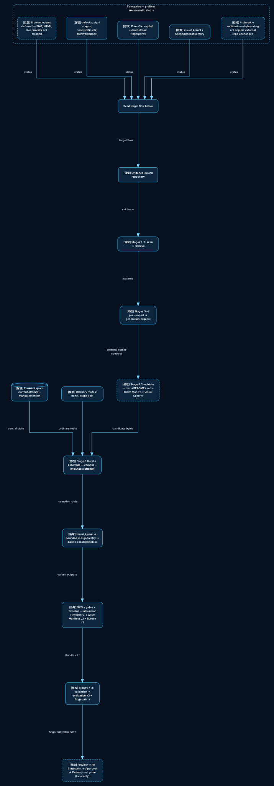

# readme-showcase × Archscribe 吸收与改进分析

> 复核日期：2026-08-05
> `readme-showcase` 执行基线：`codex/archscribe-independent-visual-kernel` / `2051a902bd3f38fae92a27070f0604d4d6afb36c`
> 执行基线 tree：`7e077dab07b39087ca77c39cbd939233a839f860`
> 当前工作树：上述 HEAD；本地文档资产在任务提交前保持未跟踪
> Archscribe 参考基线：[`46ea42cfc6c557ab238867c390bb18320fd36769`](https://github.com/lazypay/Archscribe/tree/46ea42cfc6c557ab238867c390bb18320fd36769)
> 范围：架构分析与视觉资产；不修改生产代码、README 或发布状态

## 结论

采用“项目自有 Visual Compiler Core”的方向，但不复制 Archscribe，也不重写现有图布局引擎。

最小正确边界：

```text
readme-showcase owns:
Evidence → Intent → Visual Spec → Scene IR → SVG → Visual Gates → Bundle / Approval

ELK owns:
relationship-heavy geometry only

Archscribe provides:
reference behavior + selected algorithm ideas + golden comparison fixtures
```

首期只交付 `Evidence-bound graph → ELK geometry → variant-specific Scene → deterministic SVG → manifest → bundle`。Panorama、Swimlane、PNG、Excalidraw、Motion、HTML 全部后置。

## 1. 当前 dev 的真实流程


这张图描述的是当前默认 runner 的本地生命周期，不把 opt-in 的 Plan v3 `compiled` 路线画成默认行为。执行基线已按
`2051a902bd3f38fae92a27070f0604d4d6afb36c` / tree
`7e077dab07b39087ca77c39cbd939233a839f860` 重新核对。

- 默认路线仍是 `none | static | elk`；只有显式选择 Plan v3 `diagram_route: "compiled"` 才进入视觉内核和 Bundle v3；
- 默认运行固定八个 stage：`scan → retrieve → plan-import → generation-request → candidate → bundle-assemble → validation → evaluation`，stage 名称、顺序和状态由 `run.py` 契约固定；
- `run` 创建集中式 `${CODEX_HOME:-$HOME/.codex}/state/readme-showcase/<target-key>/runs/run-<id>/` 工作区；每个 stage 追加 `attempts/<attempt>/`，并用 `current.json` 指向最近一次已提交尝试，目标仓库保持在工作区之外；
- `candidate` 是外部 Agent/人提交 README、Claim Map、Asset Manifest 和资产后再导入的边界；缺少计划或候选时 runner 会停在 `waiting-for-plan` 或 `waiting-for-candidate`，不会自行编造输入；
- `BundleAssembleStage` 对默认路线保持 legacy bundle v1；显式 compiled 计划才调用项目自有视觉内核并写 Bundle/Asset Manifest v3。compiled 失败不会改写上一次已提交的 stage 尝试；
- 内容类 validation 失败最多追加三次 revision request，安全类失败保持 fail-closed；`resume` 只从集中式 manifest 的 stale/current 状态继续；
- `preview` 读取已提交尝试，approval 默认 reject；`build-pr-bundle`、`create-approval-template` 和 `deliver --transport gh --dry-run` 都是本地交接动作，公开 delivery 不会 push、打开 PR 或调用远程 provider；
- `render_elk.mjs` 是独立、哈希校验的 `elkjs@0.9.3` / Node `22.22.3` 适配器。它可被明确的视觉编译调用，但不是这张默认 current-flow 图中的 runner stage，也没有 runner → ELK 的隐含边。

代码证据：

- [`skill/scripts/readme_showcase/orchestration/stages.py`](../../../skill/scripts/readme_showcase/orchestration/stages.py)
- [`skill/scripts/readme_showcase/orchestration/runner.py`](../../../skill/scripts/readme_showcase/orchestration/runner.py)
- [`skill/scripts/render_elk.mjs`](../../../skill/scripts/render_elk.mjs)
- [`skill/scripts/readme_showcase/validation/legacy.py`](../../../skill/scripts/readme_showcase/validation/legacy.py)
- [`skill/scripts/readme_showcase/contracts/assets.py`](../../../skill/scripts/readme_showcase/contracts/assets.py)
- [`skill/scripts/readme_showcase/delivery/github.py`](../../../skill/scripts/readme_showcase/delivery/github.py)

### 1.1 对原移交文档的校正

| 原移交假设 | 当前执行基线实际情况 | 对方案的影响 |
| --- | --- | --- |
| `none / static / glyphic` | 已迁移为 `none / static / elk` | 兼容对象改为现有 `elk`；不再设计 glyphic 迁移或测试 |
| `render_glyphic.mjs` 是当前适配器 | 当前是 vendored ELK + `render_elk.mjs` | 不重做 graph layout；把 ELK 收窄成新 compiled route 的内部 geometry backend |
| Pipeline 主要由三个顶层脚本承载 | 已拆出 contracts、scanner、retrieval、generation、orchestration、validation、evaluation、preview、delivery 模块 | 新能力接入现有 stage / contract 边界，不重写 `pipeline_core.py` |
| 先单独建设 Contracts / RenderContext 骨架 | 仓库已有 17 个 Schema，且 v1/v2 视觉契约尚未收敛 | 首期采用 Graph→Spec→Scene→SVG 垂直切片，避免新增一批“只定义、不消费”的契约 |
| README 仍以旧命令为主 | 当前基线已公开 run/resume/status/explain/preview 与命令索引 | 文档不是首期阻塞；真实缺口是视觉契约收敛和 live delivery 的公开边界 |
| 所有新 renderer 可按原八阶段铺开 | 当前 ELK 静态链路、motion approval、Preview、PR gate 已可用 | 首期只补 graph + SVG；PNG、Excalidraw、Motion、HTML 和新布局按真实缺口后置 |

## 2. Archscribe 能吸收什么

Archscribe 的优势主要在“受约束视觉规格如何变成易读技术图”，不是仓库事实提取，也不是安全发布：

| Archscribe 内容 | 处理方式 | 进入 readme-showcase 的形式 |
| --- | --- | --- |
| `panorama / swimlane / graph` 意图选择 | 吸收规则 | `DiagramIntent.purpose` 与 layout policy |
| 回边识别、loop 独立通道、longest-path layering、barycenter ordering | 参考算法与 fixture | 优先映射为 ELK constraints；只补 ELK 确认缺失的最小逻辑 |
| 文本长度、容量、ignored field 的字段级诊断 | 吸收并强化 | 统一 `Diagnostic {path, code, severity, message, action, related_ids}` |
| 一次规划，多种格式派生 | 吸收架构思想 | Scene IR 是唯一几何来源；SVG 先行，其他 renderer 后置 |
| 稳定语义 icon 与 project overview 叙事 | 选择性吸收 | 可选语义 token，不带 Archscribe 品牌视觉 |
| PNG/SVG/GIF/MP4/HTML/Excalidraw | 后置能力 | 不进入首期 DoD，不成为 README 成功依赖 |

Archscribe 当前 [`graph_model.py`](https://github.com/lazypay/Archscribe/blob/46ea42cfc6c557ab238867c390bb18320fd36769/scripts/graph_model.py) 约 844 行；其中 graph 规划包含回边识别、分层、barycenter 排序和正交 loop/skip channel。这些是可验证的参考实现，但当前 readme-showcase 已经拥有 ELK，首选“把语义编译成 ELK 约束”，而不是重新实现通用布局。

## 3. 明确删除或拒绝吸收的部分

| 删除 / 拒绝项 | 原因 | 替代方案 |
| --- | --- | --- |
| Archscribe CLI 作为生产运行时 | 增加外部安装与行为漂移 | 只在 golden comparison 工具中临时运行 |
| 原样复制 `render_animated_diagram.py` / `svg_renderer.py` | 两个文件分别约 2,581 / 2,819 行 | 小型项目内 `visual/` 垂直切片 |
| `THEME / CURRENT_PLAN / OPS_SINK / FINISH_MODE` 模块全局状态 | 不可重入、并发与测试边界差 | 显式 `RenderContext` 与不可变输入 |
| Browser / rough.js 作为静态成功依赖 | 当前 Pipeline 的静态、安全、离线边界更严格 | SVG 核心使用项目 serializer；浏览器仅后置高保真派生 |
| 所有动画帧驻留内存 | 高分辨率时资源风险 | 后置 motion 使用 frame generator → streaming encoder |
| HTML/JS 字符串直拼不可信输入 | 注入与 `</script>` 风险 | 后置 safe template + escaping + CSP + no external network |
| Archscribe 品牌化 neon/paper 作为默认 Theme | 与 project-native 视觉原则冲突 | Repository tokens → readme-showcase defaults → user overrides |
| 默认产出所有格式与动画 | 超出 README 核心需求 | SVG required；其他格式按证据与明确批准 opt-in |

Archscribe MIT 代码若发生实质复制，必须保留 MIT copyright 与 license notice。建议首期以 algorithm-inspired rewrite 和 golden fixtures 为主；任何 direct derivative 文件保留文件级 notice，并增加 `NOTICE` 来源表。

## 4. 改进后的流程



### 4.1 保留

- Scanner、Evidence v2、Retrieval、Plan Import、Generation Request；
- run/resume 状态机、stale invalidation、revision request；
- canonical JSON、原子写入、路径和 symlink gate；
- Validation、Evaluation、Preview、Approval、Publish fingerprint、Delivery boundary；
- `none / static / elk` 旧路线，在兼容期继续读取和验证。

### 4.2 修改

1. **ELK ownership**：从“semantic JSON → 最终 SVG”改成 compiled route 内部 geometry backend。旧 `elk` route 保留兼容，不再是新体系的真相来源。
2. **Runner bundle**：从固定生成 v1 bundle 改成 version-aware producer；新 compiled 资产只由 v3 producer 写出。
3. **Claim Map**：从文字 claim 扩展到节点存在、边关系、分组意义、图例、数字标注；旧 `diagram_labels` 保留读取适配。
4. **Asset Manifest**：统一 legacy v1 的 engine metadata 与 v2 的 Evidence provenance/locale，增加 Spec、Scene、Theme、variant、renderer、diagnostics、fallback 引用。
5. **Evaluation**：从“资产存在且 provenance 可绑定”扩展到 Spec→Scene、Scene→Artifact、Evidence coverage、overflow、overlap、out-of-bounds、determinism。
6. **Fingerprint**：关键输入包括 Intent、Visual Spec、variant Scene、Theme、renderer identity、资产、Visual Gates；任一变化撤销旧批准。

### 4.3 新增

建议最小目录，不预建未使用后端：

```text
skill/scripts/readme_showcase/visual/
├── contracts.py       # Intent / VisualSpec / Scene / diagnostics
├── compiler.py        # evidence binding + compile orchestration
├── elk_backend.py     # 调用现有 render_elk.mjs 的 geometry 模式
├── scene.py           # geometry → owned primitives
├── svg.py             # Scene → deterministic standalone SVG
└── gates.py           # security / semantic / geometry / accessibility
```

不建立一实现接口、插件市场、renderer registry 或远程服务。

## 5. 关键领域约束

### Diagram Intent

- 回答图要解决的问题、目标读者、必需事实、应省略内容、复杂度预算；
- 在编译前判断 Markdown 或表格是否更合适；
- 首期 purpose 仅支持 `architecture-overview` / `runtime-flow` 中可映射为 graph 的子集。

### Visual Spec

- 只含语义节点、边、分组、label、support state、Evidence IDs、layout policy；
- `verified` 必须直接绑定 Evidence；
- `inferred` 必须绑定推断输入与解释；
- `editorial` 必须声明解释目的；
- `unverified` 不得进入正式资产；
- 不接受绝对路径、任意 URL、HTML、脚本、浏览器代码、后端字体路径。

### Scene IR

- 一个 Visual Spec 可编译为多份 variant-specific Scene；desktop 和 mobile 不共享坐标；
- 每个可见 primitive 必须拥有 `node / edge / group / decoration` owner；
- interaction region、animation track 和派生 renderer 只能引用 Scene ID；
- Scene 是 geometry gate 和 artifact coverage 的唯一来源。

### Determinism

首期 cache key：

```text
hash(
  normalized_visual_spec
  + scene_builder_version
  + elk_module_sha256
  + svg_renderer_sha256
  + theme_sha256
  + variant
  + locale
)
```

SVG 要求同 cache key 字节一致。PNG、浏览器或系统字体相关格式后置，并分别声明环境身份与允许的确定性等级。

## 6. 分期

### VC0：固定基线

- 固定执行基线 `readme-showcase 2051a90`（tree `7e077dab`）与 Archscribe `46ea42c`；
- 选 3–6 个小 fixture；
- 保存 semantic JSON、geometry summary、Scene snapshot 和少量视觉 preview；
- 验证当前 none/static/elk、bundle、evaluation、approval、delivery 回归；
- 不改 production route。

### VC1：Graph + SVG walking skeleton

- 同一批实现 Intent、Visual Spec、ELK geometry、Scene、SVG、基础 Gates；
- 不做只定义不消费的 Contract 阶段；
- CLI 仅提供实验 compile 命令或 feature flag；
- 任何缺字段、丢节点、丢边、溢出、越界、安全错误都结构化失败。

### VC2：Contract convergence 与 Pipeline Integration

- 新增 Plan / Claim Map / Asset Manifest / Bundle v3；
- v1/v2 继续读取，producer 默认仍保持旧行为；
- `compiled` 显式启用后才写出 v3；
- runner、evaluation、preview、PR fingerprint 接入 Spec/Scene/Theme/Gates；
- compiled 失败不覆盖 last-known-good，不修改 README 引用。

### VC3：Theme 与 variants

- Repository-native tokens → 默认 Theme → 用户 overrides；
- desktop / mobile 各自 Scene；
- 900px 与 360px 检查；
- 只有真实图表超载后才增加拆图建议。

### VC4 以后：按真实缺口增量加入

- Panorama / Swimlane；
- PNG 或 editable output；
- opt-in Motion；
- safe Evidence Explorer。

## 7. 首期验收

- 一个真实仓库生成 Evidence-bound graph SVG；
- 所有核心节点、边、label、分组均有 Evidence 或 editorial 状态；
- Spec 元素 100% 进入 Scene，Scene 语义元素 100% 进入 SVG；
- 无静默丢失、核心文本溢出、核心节点越界；
- 同 cache key 连续渲染 SVG 字节一致；
- 900px 可读；360px 使用独立 Scene 或明确降级；
- Spec、Scene、Theme、renderer、SVG、Gate 结果进入 Manifest 和 fingerprint；
- none/static/elk、motion approval、validation、evaluation、preview、approval、delivery 旧测试保持通过；
- 浏览器、Archscribe CLI、PNG、动画、HTML 不成为首期成功依赖。

## 8. 当前已知边界

- 当前 README 已公开 run/resume/status/explain/preview 和分组命令索引；approval/delivery/feedback 的独立入口仍未完整进入首页主流程，本方案不顺带修改 README。
- 公开 `deliver` CLI 只允许 GitHub dry-run。内部 live executor 的存在不等于当前已具备用户可调用的远程发布闭环。
- 本次只新增本目录中的分析文档与两张 SVG；README、生产代码和发布状态未改动。
